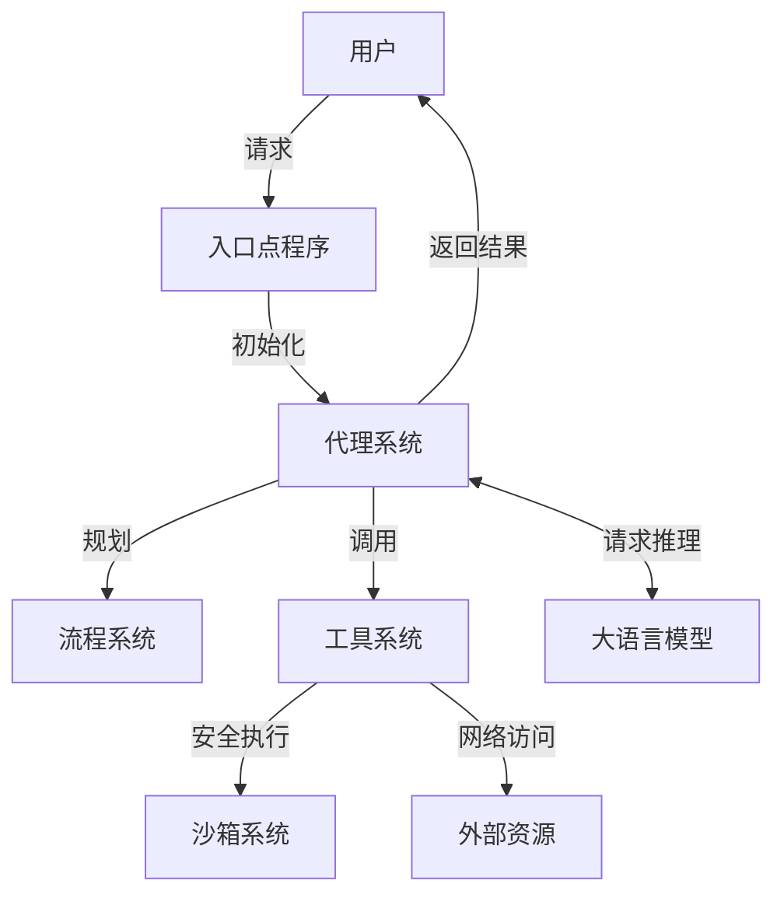

# OpenManus 代码库架构分析

## 1. 系统概述

OpenManus 是一个基于大语言模型的多功能代理框架，旨在通过组合多种工具和能力来解决复杂任务。核心功能包括：

- 基于大语言模型的智能代理系统
- 规划和执行复杂任务的工作流程
- 丰富的工具集合（Python执行、文件操作、网页浏览等）
- 模块化架构设计，支持扩展和定制

项目采用 Python 异步编程模式实现，使用 Pydantic 进行配置和数据验证，依赖大语言模型（主要是 Claude 和 OpenAI）提供核心推理能力。

## 2. 主要组件解析

### 2.1 代理系统 (app/agent/)

代理是系统的核心执行单元，负责接收用户请求并调用工具完成任务。

- **基础代理 (`BaseAgent`)**: 抽象基类，定义了代理的基础结构和生命周期管理（状态转换、内存管理、执行循环等）
- **Manus 代理 (`Manus`)**: 主要通用代理实现，集成了多种工具能力
- **浏览器代理 (`BrowserAgent`)**: 提供网页浏览和交互能力的专用代理
- **CoT 代理 (`CoTAgent`)**: 实现思维链推理的代理
- **React 代理 (`ReactAgent`)**: 实现反思-行动循环的代理
- **规划代理 (`PlanningAgent`)**: 负责规划和执行复杂任务
- **工具调用代理 (`ToolCallAgent`)**: 专门处理工具调用的代理

### 2.2 工具系统 (app/tool/)

工具提供代理与外部环境交互的能力，包括:

- **终端交互**: 执行系统命令和脚本
- **Python 执行**: 直接执行 Python 代码
- **文件操作**: 读取、写入和管理文件
- **网页浏览**: 访问和交互网页内容
- **搜索工具**: 通过多种搜索引擎获取在线信息
- **规划工具**: 创建和管理任务计划
- **字符替换编辑器**: 编辑文本文件内容

工具系统统一使用 `BaseTool` 抽象类定义接口，工具调用结果通过 `ToolResult` 类封装。

### 2.3 流程系统 (app/flow/)

流程管理多个代理的协作，实现任务的自动规划和执行：

- **基础流程 (`BaseFlow`)**: 提供流程的抽象接口和代理管理
- **规划流程 (`PlanningFlow`)**: 主要流程实现，支持计划创建和执行

### 2.4 大语言模型接口 (app/llm.py)

封装与大语言模型的交互，处理各种模型的差异和响应解析：

- 支持 Claude、OpenAI、Azure OpenAI 等多种模型服务
- 管理对话上下文和模型调用参数
- 处理工具调用和结果解析

### 2.5 沙箱系统 (app/sandbox/)

提供安全的代码执行环境，隔离代码执行以保护主系统：

- **沙箱客户端 (`SandboxClient`)**: 提供与沙箱环境交互的接口
- **沙箱管理器 (`SandboxManager`)**: 管理沙箱实例的创建和销毁
- **终端接口 (`Terminal`)**: 提供与沙箱终端交互的能力

### 2.6 配置系统 (app/config.py)

管理系统配置，支持从文件和环境变量加载设置：

- LLM 配置（模型、API密钥、参数等）
- 浏览器设置
- 搜索引擎配置
- 沙箱环境配置

### 2.7 提示词系统 (app/prompt/)

存储各种代理使用的系统提示和指令模板：

- 为不同代理（Manus、CoT、React 等）定义特定的提示词
- 定义工具使用和推理的指令模板

## 3. 执行流程解析

系统提供了三种主要入口和执行流程：

### 3.1 单次命令执行 (main.py)

```
用户输入 -> Manus代理初始化 -> 处理请求 -> 返回结果
```

简单的命令行接口，适用于处理单次请求，不保留会话状态。

### 3.2 流程执行 (run_flow.py)

```
用户输入 -> 创建规划流程 -> 生成任务计划 -> 执行计划步骤 -> 返回结果
```

具有规划能力的流程执行，可以处理复杂任务并自动规划执行步骤。

### 3.3 MCP 执行 (run_mcp.py 和 run_mcp_server.py)

```
启动MCP服务 -> 接收用户请求 -> 处理并分发到合适的代理 -> 返回结果
```

提供服务化的代理接口，支持长期运行和多用户请求。

## 4. 核心数据流



## 5. 扩展机制

OpenManus 提供了几种主要的扩展机制：

1. **新代理开发**: 继承 `BaseAgent` 实现特定功能的代理
2. **新工具添加**: 继承 `BaseTool` 创建新的工具类
3. **新流程定义**: 继承 `BaseFlow` 实现新的任务流程
4. **模型适配**: 在 `LLM` 类中添加对新模型的支持

## 6. 配置和定制

系统通过 `config/config.toml` 文件进行配置，支持定制多个方面：

- 使用不同的大语言模型提供商和参数
- 配置浏览器行为和代理设置
- 调整工具行为和执行参数
- 配置沙箱环境安全级别

## 7. 主要依赖关系

- **核心运行时依赖**: Python 3.10+, asyncio
- **数据处理**: Pydantic
- **LLM API**: anthropic, openai, boto3 (AWS Bedrock)
- **浏览器控制**: playwright
- **沙箱环境**: Docker API
- **请求处理**: aiohttp, requests

## 8. 项目结构概要

```
OpenManus/
├── app/                # 核心应用代码
│   ├── agent/          # 代理实现
│   ├── flow/           # 流程实现
│   ├── mcp/            # MCP 服务
│   ├── prompt/         # 提示词模板
│   ├── sandbox/        # 沙箱环境
│   ├── tool/           # 工具实现
│   ├── config.py       # 配置管理
│   ├── llm.py          # 大语言模型接口
│   └── schema.py       # 数据模型定义
├── config/             # 配置文件目录
├── examples/           # 示例代码和用例
├── tests/              # 测试代码
├── workspace/          # 工作空间目录
├── main.py             # 主入口
├── run_flow.py         # 流程执行入口
├── run_mcp.py          # MCP 客户端入口
└── run_mcp_server.py   # MCP 服务器入口
```
