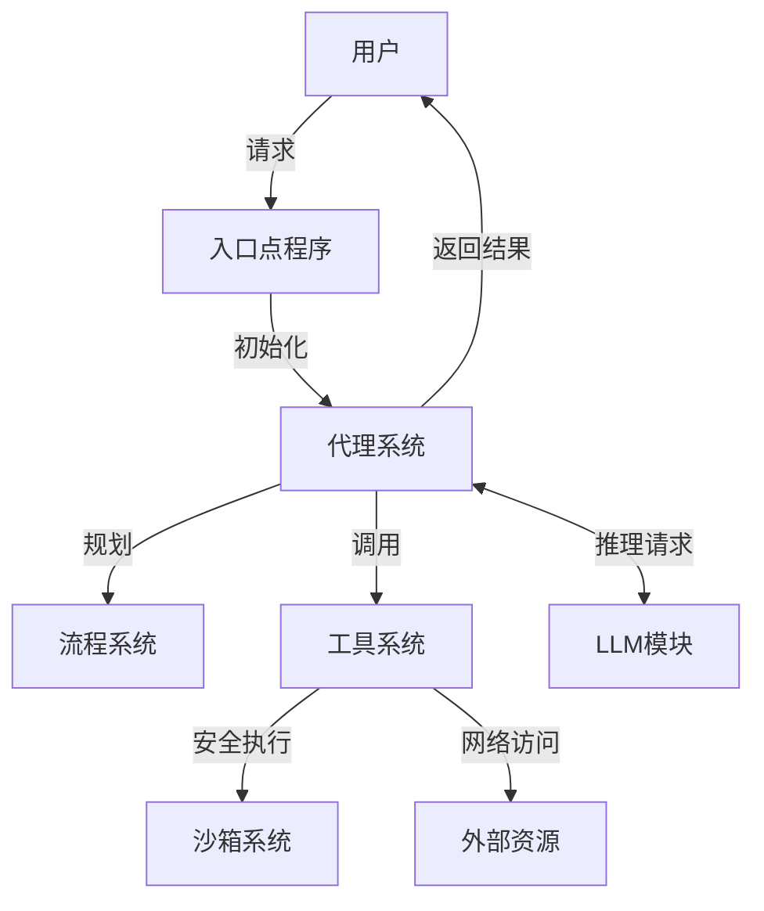

# OpenManus 代码库走读报告

## 导航

- [架构分析](architecture_analysis.md) - 系统整体架构分析
- [迭代1：代理系统分析](iteration_1_analysis.md) - 深入分析代理系统
- [迭代2：工具系统分析](iteration_2_analysis.md) - 深入分析工具系统
- [迭代3：流程系统分析](iteration_3_analysis.md) - 深入分析流程系统
- [迭代4：LLM和沙箱系统分析](iteration_4_analysis.md) - 深入分析LLM和沙箱系统

## 系统架构总结

OpenManus 是一个基于大语言模型（LLM）的多功能代理框架，采用模块化设计，通过组合多种工具和能力来解决复杂任务。系统的核心架构可以分为以下几个主要部分：

1. **代理系统（Agent System）**：核心执行单元，负责接收用户请求并调用工具完成任务
2. **工具系统（Tool System）**：提供代理与外部环境交互的能力，包括终端操作、文件管理等
3. **流程系统（Flow System）**：管理多个代理的协作，实现任务的自动规划和执行
4. **LLM模块（LLM Module）**：封装与大语言模型的交互，处理请求和响应
5. **沙箱系统（Sandbox System）**：提供安全隔离的代码和命令执行环境

系统的执行流程遵循 "输入 -> 规划 -> 执行 -> 输出" 的模式，通过多个代理和工具的协作完成复杂任务。

## 关键组件及其职责总结

### 1. 代理系统

代理系统是 OpenManus 的核心，基于 `BaseAgent` 抽象类实现了多种代理：

- **Manus代理**：主要通用代理，集成了多种工具能力
- **React代理**：实现反思-行动循环的代理
- **CoT代理**：实现思维链推理的代理
- **规划代理**：负责任务规划和执行
- **工具调用代理**：专门处理工具调用的代理
- **浏览器代理**：提供网页交互能力的代理

代理系统采用了思考-行动-观察的执行循环，每个代理具有内存、状态管理和执行控制能力。

### 2. 工具系统

工具系统基于 `BaseTool` 抽象类实现了多种工具：

- **终端工具**：执行系统命令
- **Python执行工具**：执行Python代码
- **文件操作工具**：读写文件
- **浏览器工具**：网页浏览和交互
- **规划工具**：任务计划管理
- **搜索工具**：网络搜索
- **终止工具**：控制执行流程

工具系统设计了统一的接口和结果封装机制，支持工具组合和安全执行。

### 3. 流程系统

流程系统是一个高级抽象层，管理多个代理的协作：

- **基础流程**：提供代理管理和基本流程接口
- **规划流程**：实现基于计划的任务分解和执行

流程系统支持任务的自动规划、分步执行和状态追踪，通过工厂模式创建不同类型的流程实例。

### 4. LLM模块

LLM模块封装了与大语言模型的交互：

- 支持多种模型服务（OpenAI、Claude、Bedrock等）
- 统一的消息格式和接口
- 工具调用支持
- 错误处理和日志记录

LLM模块屏蔽了不同模型服务的差异，提供了统一的高级接口。

### 5. 沙箱系统

沙箱系统提供了安全隔离的执行环境：

- 基于Docker的容器隔离
- 资源限制（内存、CPU、网络）
- 命令和代码执行接口
- 安全策略管理

沙箱系统使代理可以安全地执行用户代码和命令，避免安全风险。

## 主要流程和数据流总结

### 1. 单次命令执行流程

```
用户输入 -> Manus代理初始化 -> 处理请求（思考-执行-观察） -> 返回结果
```

适用于处理单次请求，不保留会话状态。

### 2. 规划流程执行

```
用户输入 -> 创建规划流程 -> 生成任务计划 -> 执行计划步骤（迭代） -> 返回结果
```

适用于复杂任务，支持任务分解和自动执行。

### 3. 工具调用流程

```
代理 -> 获取工具 -> 执行工具 -> 处理结果 -> 更新状态
```

工具提供了代理与外部环境交互的能力。

### 4. LLM交互流程

```
准备消息 -> 根据模型类型选择API -> 发送请求 -> 解析响应 -> 返回结果
```

统一封装了与不同LLM服务的交互。

## 设计模式和实现特点

### 1. 设计模式

- **抽象工厂模式**：用于创建不同类型的流程实例
- **策略模式**：不同代理和工具实现不同策略
- **组合模式**：工具可以组合使用
- **单例模式**：沙箱客户端采用单例模式
- **观察者模式**：状态变化通知和更新
- **命令模式**：工具调用和执行

### 2. 关键实现特点

- **异步编程**：全面使用 `async/await` 提高性能
- **类型安全**：使用类型注解和 Pydantic 模型
- **配置驱动**：高度可配置的设计
- **模块化架构**：清晰的模块边界和接口
- **状态管理**：完善的状态转换和错误处理
- **文档完善**：详细的代码注释和文档字符串

## 代码质量评估

总体而言，OpenManus 的代码质量较高，表现在以下几个方面：

### 1. 可读性和可维护性

- 命名规范统一，描述性强
- 代码结构清晰，模块化良好
- 注释充分，文档字符串完整
- 职责分离，单一职责原则遵循良好

### 2. 可扩展性和可重用性

- 抽象设计良好，便于扩展
- 接口统一，降低耦合度
- 组件可独立使用和替换
- 配置和实现分离

### 3. 健壮性和错误处理

- 统一的错误处理机制
- 状态验证和安全检查
- 超时控制和资源管理
- 日志记录和调试支持

### 4. 性能和资源管理

- 异步编程提高并发性能
- 资源限制和清理机制
- 沙箱隔离减少风险
- 配置支持性能调优

## 项目结构图



## 潜在改进建议

通过代码走读，我们发现OpenManus有以下几个潜在的改进方向：

### 1. 代理系统

- **并发控制**：支持并行执行多个工具操作
- **内存优化**：实现内存压缩或摘要机制，处理长对话
- **错误恢复**：增强错误处理和恢复机制

### 2. 工具系统

- **工具依赖管理**：添加工具间依赖和组合执行的支持
- **权限控制**：实现更细粒度的工具执行权限控制
- **缓存机制**：为频繁使用的工具结果添加缓存

### 3. 流程系统

- **条件分支支持**：增加对条件分支和决策点的支持
- **并行执行能力**：支持多个不相互依赖的步骤并行执行
- **动态计划修改**：增强执行过程中动态调整计划的能力

### 4. LLM模块

- **缓存机制**：增加模型响应缓存，减少API调用
- **故障转移**：增强错误重试和故障转移能力
- **流式处理**：添加模型响应的流式处理支持

### 5. 沙箱系统

- **多后端支持**：支持更多沙箱后端（如WebAssembly）
- **文件系统隔离**：增加文件系统隔离和权限管理
- **环境池**：实现沙箱环境池，提高并发处理能力

## 结论

OpenManus 是一个设计良好的代理框架，通过模块化组件和统一接口实现了复杂任务的自动化处理。系统充分利用了大语言模型的能力，结合规划、工具调用和安全执行机制，构建了一个灵活且强大的智能代理系统。

项目采用了现代软件工程实践，包括异步编程、类型安全、模块化设计和完善的错误处理，代码质量整体较高。虽然仍有改进空间，但已经提供了一个坚实的基础，可以支持多种应用场景和功能扩展。

## 工作流执行摘要

- **扫描的项目路径**: `/d:/workcode/OpenManus-docs`
- **生成的文件**:
  - `output/architecture_analysis.md` - 架构分析
  - `output/iteration_1_analysis.md` - 代理系统分析
  - `output/iteration_2_analysis.md` - 工具系统分析
  - `output/iteration_3_analysis.md` - 流程系统分析
  - `output/iteration_4_analysis.md` - LLM和沙箱系统分析
  - `output/final_report.md` - 最终报告
- **处理的核心文件/模块**:
  - 代理系统 (`app/agent/`)
  - 工具系统 (`app/tool/`)
  - 流程系统 (`app/flow/`)
  - LLM模块 (`app/llm.py`)
  - 沙箱系统 (`app/sandbox/`)
  - 配置模块 (`app/config.py`)
  - 入口点 (`main.py`, `run_flow.py`, `run_mcp.py`, `run_mcp_server.py`)
