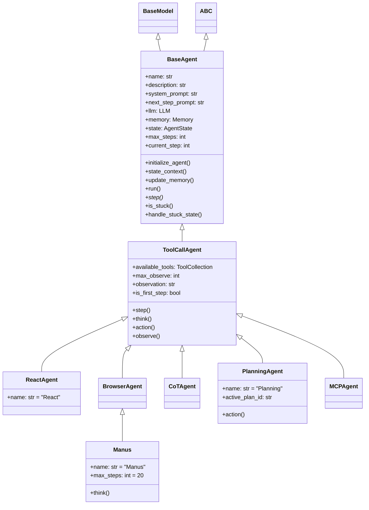

# 模块分析：代理系统（Agent System）

## 概述

代理系统是 OpenManus 的核心模块，提供了智能代理的基础架构和多种代理实现。代理负责接收用户请求，进行决策，调用工具完成任务，并返回执行结果。代理系统采用了抽象类和继承的设计模式，便于扩展和定制。

## 核心组件解析

### 1. 基础代理类 (`BaseAgent`)

位于 `app/agent/base.py` 的 `BaseAgent` 类是所有代理的抽象基类，定义了代理的基础结构和通用功能：

```python
class BaseAgent(BaseModel, ABC):
    # 核心属性
    name: str = Field(..., description="Unique name of the agent")
    description: Optional[str] = Field(None, description="Optional agent description")

    # 提示词
    system_prompt: Optional[str] = Field(None, description="System-level instruction prompt")
    next_step_prompt: Optional[str] = Field(None, description="Prompt for determining next action")

    # 依赖
    llm: LLM = Field(default_factory=LLM, description="Language model instance")
    memory: Memory = Field(default_factory=Memory, description="Agent's memory store")
    state: AgentState = Field(default=AgentState.IDLE, description="Current agent state")

    # 执行控制
    max_steps: int = Field(default=10, description="Maximum steps before termination")
    current_step: int = Field(default=0, description="Current step in execution")

    # 重复检测阈值
    duplicate_threshold: int = 2
```

#### 关键功能：

1. **状态管理**：通过 `state_context` 方法安全地管理代理状态转换
2. **内存操作**：使用 `update_memory` 方法管理代理的消息历史
3. **执行循环**：`run` 方法实现了代理的主执行循环，控制步骤迭代
4. **重复检测**：`is_stuck` 和 `handle_stuck_state` 方法用于检测和处理代理陷入循环的情况

代理状态由 `AgentState` 枚举类表示，包括 `IDLE`、`RUNNING`、`FINISHED` 和 `ERROR` 等状态。

### 2. Manus 代理 (`Manus`)

`Manus` 是核心通用代理实现，继承自 `BrowserAgent`，集成了多种工具能力：

```python
class Manus(BrowserAgent):
    name: str = "Manus"
    description: str = "A versatile agent that can solve various tasks using multiple tools"

    system_prompt: str = SYSTEM_PROMPT.format(directory=config.workspace_root)
    next_step_prompt: str = NEXT_STEP_PROMPT

    max_observe: int = 10000
    max_steps: int = 20

    # 工具集合
    available_tools: ToolCollection = Field(
        default_factory=lambda: ToolCollection(
            PythonExecute(), BrowserUseTool(), StrReplaceEditor(), Terminate()
        )
    )
```

`Manus` 代理重写了 `think` 方法，用于处理浏览器上下文和普通上下文的切换：

```python
async def think(self) -> bool:
    # 存储原始提示词
    original_prompt = self.next_step_prompt

    # 检测最近的消息是否涉及浏览器操作
    recent_messages = self.memory.messages[-3:] if self.memory.messages else []
    browser_in_use = any(
        "browser_use" in msg.content.lower()
        for msg in recent_messages
        if hasattr(msg, "content") and isinstance(msg.content, str)
    )

    if browser_in_use:
        # 临时使用浏览器专用提示词
        self.next_step_prompt = BROWSER_NEXT_STEP_PROMPT

    # 调用父类的think方法
    result = await super().think()

    # 恢复原始提示词
    self.next_step_prompt = original_prompt

    return result
```

### 3. 工具调用代理 (`ToolCallAgent`)

`ToolCallAgent` 是一个专门处理工具调用的代理，提供了标准化的思考-执行循环：

```python
class ToolCallAgent(BaseAgent, ABC):
    available_tools: ToolCollection = Field(default_factory=ToolCollection)

    # 观察结果的最大长度
    max_observe: int = Field(default=4000)

    # 当前观察结果
    observation: str = Field(default="")

    # 是否为第一步执行
    is_first_step: bool = Field(default=True)

    # 执行单个步骤
    async def step(self) -> str:
        if self.is_first_step:
            self.is_first_step = False
            await self.observe("Starting new task")

        # 思考决策
        do_action = await self.think()

        if do_action:
            # 执行动作
            await self.action()

        return self.observation
```

核心流程包括：

1. **思考 (`think`)**：根据当前状态和历史决定下一步行动
2. **行动 (`action`)**：执行决策产生的行动，调用工具
3. **观察 (`observe`)**：记录执行结果，更新代理状态

### 4. React 代理 (`ReactAgent`)

实现了反思-行动循环模式的代理，适用于需要多步推理的任务：

```python
class ReactAgent(ToolCallAgent):
    name: str = "React"
    description: str = "A Reasoning and Acting agent inspired by the ReAct framework"

    system_prompt: str = SYSTEM_PROMPT
    next_step_prompt: str = NEXT_STEP_PROMPT
```

### 5. 规划代理 (`PlanningAgent`)

专注于任务规划和执行的代理，使用规划工具创建和管理任务计划：

```python
class PlanningAgent(ToolCallAgent):
    name: str = "Planning"
    description: str = "A planning agent for handling task planning and execution"

    system_prompt: str = SYSTEM_PROMPT
    next_step_prompt: str = NEXT_STEP_PROMPT

    # 当前活动计划ID
    active_plan_id: Optional[str] = None

    # 重写action方法实现计划管理
    async def action(self) -> None:
        # 处理计划创建、更新和执行
        ...
```

## 代理系统类图



## 代理执行流程

```mermaid
sequenceDiagram
    participant User
    participant BaseAgent
    participant LLM
    participant Tool

    User->>BaseAgent: run(request)
    BaseAgent->>BaseAgent: update_memory("user", request)

    loop max_steps
        BaseAgent->>BaseAgent: state_context(RUNNING)
        BaseAgent->>BaseAgent: step()

        alt ToolCallAgent
            BaseAgent->>LLM: think()
            LLM-->>BaseAgent: next action decision

            alt do_action is true
                BaseAgent->>Tool: action()
                Tool-->>BaseAgent: result
                BaseAgent->>BaseAgent: observe(result)
            end
        end

        BaseAgent->>BaseAgent: is_stuck()

        alt is stuck
            BaseAgent->>BaseAgent: handle_stuck_state()
        end

        alt state is FINISHED
            break out of loop
        end
    end

    BaseAgent-->>User: result
```

## 关键发现和特点

1. **模块化设计**：代理系统采用了高度模块化的设计，通过抽象类和组合模式实现了灵活的功能扩展
2. **状态管理**：使用上下文管理器处理状态转换，增强了代码的健壮性
3. **异步编程**：全面采用 Python 异步编程范式，提高了代理的执行效率
4. **思考-行动-观察循环**：实现了标准的 AI 代理循环模式，支持复杂推理
5. **重复检测**：内置了循环检测机制，避免代理陷入无限循环
6. **工具集成**：通过 `ToolCollection` 灵活集成各种工具能力

## 待讨论点

1. **并发控制**：当前代理执行是串行的，考虑支持并行执行多个工具操作
2. **错误恢复**：增强错误处理和恢复机制，提高代理系统的鲁棒性
3. **内存优化**：长对话可能导致内存占用过大，考虑实现内存压缩或摘要机制
