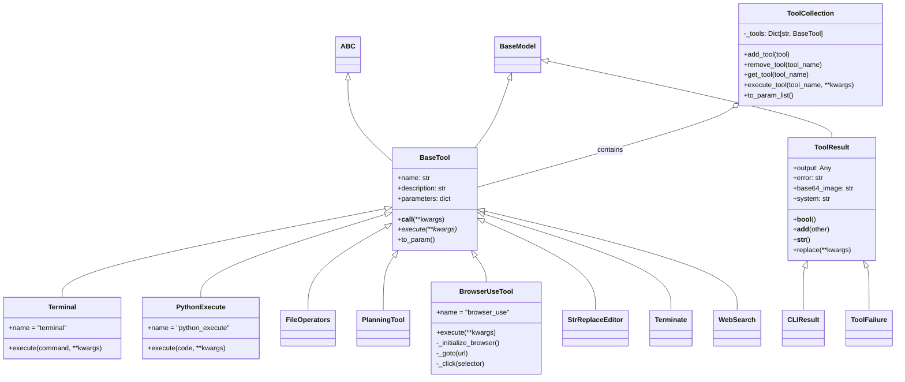
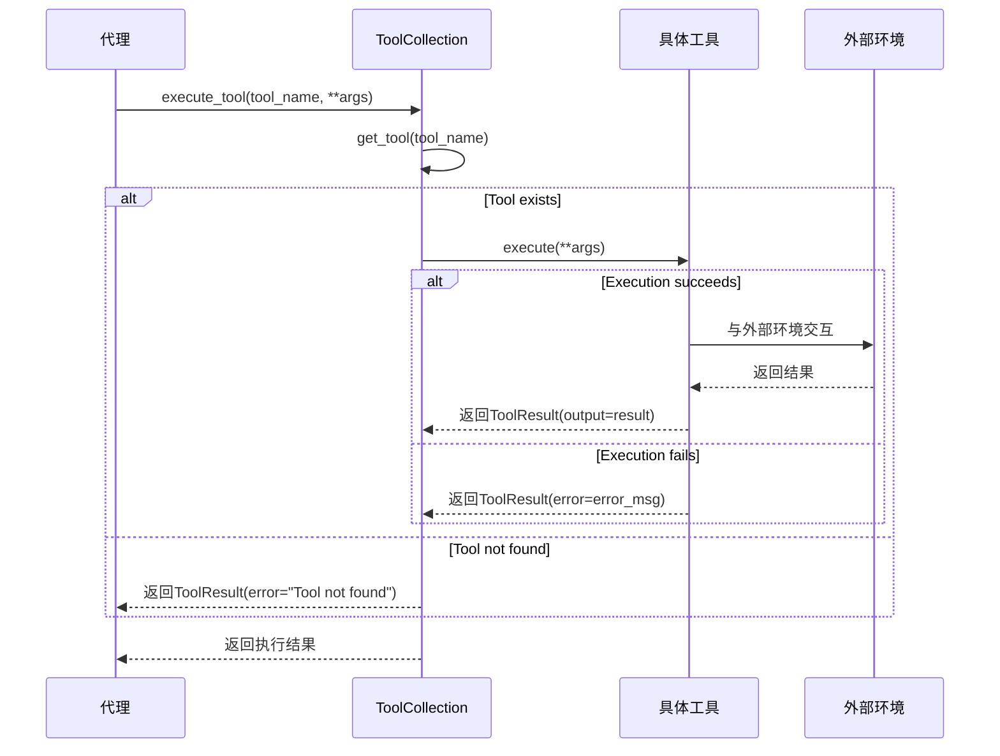

# 模块分析：工具系统（Tool System）

## 概述

工具系统是 OpenManus 的关键组成部分，提供了代理与外部环境交互的能力。工具系统基于统一的抽象接口设计，支持丰富的功能扩展，包括终端操作、文件管理、Python 代码执行、网页浏览等多种能力。系统采用组合模式设计，允许工具的灵活组织和调用。

## 核心组件解析

### 1. 基础工具类 (`BaseTool`)

位于 `app/tool/base.py` 的 `BaseTool` 类是所有工具的抽象基类，定义了统一的工具接口：

```python
class BaseTool(ABC, BaseModel):
    name: str
    description: str
    parameters: Optional[dict] = None

    class Config:
        arbitrary_types_allowed = True

    # 允许工具实例直接作为函数调用
    async def __call__(self, **kwargs) -> Any:
        """Execute the tool with given parameters."""
        return await self.execute(**kwargs)

    # 抽象方法，具体工具必须实现此方法
    @abstractmethod
    async def execute(self, **kwargs) -> Any:
        """Execute the tool with given parameters."""

    # 转换为API函数调用格式
    def to_param(self) -> Dict:
        """Convert tool to function call format."""
        return {
            "type": "function",
            "function": {
                "name": self.name,
                "description": self.description,
                "parameters": self.parameters,
            },
        }
```

### 2. 工具结果类 (`ToolResult`)

工具执行结果通过 `ToolResult` 类统一封装，包含输出、错误信息和附加数据：

```python
class ToolResult(BaseModel):
    """Represents the result of a tool execution."""

    output: Any = Field(default=None)
    error: Optional[str] = Field(default=None)
    base64_image: Optional[str] = Field(default=None)
    system: Optional[str] = Field(default=None)

    class Config:
        arbitrary_types_allowed = True

    # 检查结果是否有任何内容
    def __bool__(self):
        return any(getattr(self, field) for field in self.__fields__)

    # 合并两个工具结果
    def __add__(self, other: "ToolResult"):
        # 合并结果字段的逻辑...

    # 转换为字符串，优先显示错误信息
    def __str__(self):
        return f"Error: {self.error}" if self.error else self.output
```

### 3. 工具集合 (`ToolCollection`)

`ToolCollection` 是一个特殊的容器类，用于管理和组织多个工具：

```python
class ToolCollection:
    """A collection of tools that can be used by agents."""

    def __init__(self, *tools: BaseTool):
        self._tools: Dict[str, BaseTool] = {}
        for tool in tools:
            self.add_tool(tool)

    def add_tool(self, tool: BaseTool) -> None:
        """Add a tool to the collection."""
        self._tools[tool.name] = tool

    def remove_tool(self, tool_name: str) -> None:
        """Remove a tool from the collection by name."""
        if tool_name in self._tools:
            del self._tools[tool_name]

    def get_tool(self, tool_name: str) -> Optional[BaseTool]:
        """Get a tool by name."""
        return self._tools.get(tool_name)

    async def execute_tool(self, tool_name: str, **kwargs) -> ToolResult:
        """Execute a tool by name with the given arguments."""
        tool = self.get_tool(tool_name)
        if not tool:
            return ToolResult(error=f"Tool '{tool_name}' not found")

        try:
            result = await tool.execute(**kwargs)
            if isinstance(result, ToolResult):
                return result
            return ToolResult(output=result)
        except Exception as e:
            return ToolResult(error=f"Error executing tool '{tool_name}': {str(e)}")
```

### 4. 终端工具 (`Terminal`)

`Terminal` 工具提供了执行系统命令的能力，支持同步和异步执行：

```python
class Terminal(BaseTool):
    name: str = "terminal"
    description: str = "Run commands in the terminal and capture output"

    parameters: dict = {
        "type": "object",
        "properties": {
            "command": {
                "type": "string",
                "description": "The command to execute in the terminal",
            }
        },
        "required": ["command"],
    }

    async def execute(self, command: str, **kwargs) -> ToolResult:
        """Execute a command in the terminal and return the result."""
        try:
            # 支持沙箱中执行命令
            if SANDBOX_CLIENT.is_available():
                sandbox_result = await SANDBOX_CLIENT.run_command(command)
                return ToolResult(output=sandbox_result)

            # 本地执行命令
            process = await asyncio.create_subprocess_shell(
                command,
                stdout=asyncio.subprocess.PIPE,
                stderr=asyncio.subprocess.PIPE,
                cwd=config.workspace_root,
            )

            stdout, stderr = await process.communicate()

            if stderr and process.returncode != 0:
                return ToolResult(
                    error=f"Command failed with code {process.returncode}: {stderr.decode()}"
                )

            return ToolResult(output=stdout.decode())
        except Exception as e:
            return ToolResult(error=f"Failed to execute command: {str(e)}")
```

### 5. Python 执行工具 (`PythonExecute`)

`PythonExecute` 工具允许代理直接执行 Python 代码：

```python
class PythonExecute(BaseTool):
    name: str = "python_execute"
    description: str = "Execute Python code and return the result"

    parameters: dict = {
        "type": "object",
        "properties": {
            "code": {
                "type": "string",
                "description": "Python code to execute",
            },
        },
        "required": ["code"],
    }

    async def execute(self, code: str, **kwargs) -> ToolResult:
        """Execute Python code and return the result."""
        try:
            # 优先使用沙箱执行代码
            if SANDBOX_CLIENT.is_available():
                sandbox_result = await SANDBOX_CLIENT.run_python(code)
                return ToolResult(output=sandbox_result)

            # 本地执行代码
            result_output = io.StringIO()

            # 重定向标准输出和错误
            with redirect_stdout(result_output), redirect_stderr(result_output):
                try:
                    exec_globals = {"__builtins__": __builtins__}
                    exec(code, exec_globals)
                except Exception as e:
                    traceback.print_exc(file=result_output)

            return ToolResult(output=result_output.getvalue())
        except Exception as e:
            return ToolResult(error=f"Failed to execute Python code: {str(e)}")
```

### 6. 浏览器工具 (`BrowserUseTool`)

提供网页浏览和交互功能，是功能最复杂的工具之一：

```python
class BrowserUseTool(BaseTool):
    name: str = "browser_use"
    description: str = "Use web browser to visit websites and extract information"

    parameters: dict = {
        "type": "object",
        "properties": {
            "action": {
                "type": "string",
                "enum": ["goto", "click", "type", "back", "forward", "scroll", "screenshot", "get_text"],
                "description": "Action to perform in the browser",
            },
            "url": {
                "type": "string",
                "description": "URL to navigate to (for goto action)",
            },
            # 其他参数定义...
        },
        "required": ["action"],
    }

    async def execute(self, **kwargs) -> ToolResult:
        """Execute browser actions and return the result."""
        # 初始化浏览器（如果尚未初始化）
        if not hasattr(self, "_browser") or self._browser is None:
            self._browser = await self._initialize_browser()

        action = kwargs.get("action")
        # 执行相应的浏览器操作
        if action == "goto":
            return await self._goto(kwargs.get("url"))
        elif action == "click":
            return await self._click(kwargs.get("selector"))
        # 其他动作处理...
```

### 7. 文件操作工具 (`FileOperators`)

提供文件读写和管理功能：

```python
class FileOperators(BaseTool):
    name: str = "file_operation"
    description: str = "Perform file operations like reading and writing files"

    parameters: dict = {
        "type": "object",
        "properties": {
            "operation": {
                "type": "string",
                "enum": ["read", "write", "list", "delete"],
                "description": "The file operation to perform",
            },
            "file_path": {
                "type": "string",
                "description": "Path to the file, relative to workspace directory",
            },
            "content": {
                "type": "string",
                "description": "Content to write (for write operation)",
            },
        },
        "required": ["operation", "file_path"],
    }

    async def execute(self, **kwargs) -> ToolResult:
        """Execute file operations and return the result."""
        operation = kwargs.get("operation")
        file_path = kwargs.get("file_path")

        # 确保文件路径安全（避免目录遍历攻击）
        safe_path = self._get_safe_path(file_path)

        if operation == "read":
            return await self._read_file(safe_path)
        elif operation == "write":
            content = kwargs.get("content", "")
            return await self._write_file(safe_path, content)
        elif operation == "list":
            return await self._list_directory(safe_path)
        elif operation == "delete":
            return await self._delete_file(safe_path)
        else:
            return ToolResult(error=f"Unsupported operation: {operation}")
```

### 8. 规划工具 (`PlanningTool`)

支持任务计划的创建和管理：

```python
class PlanningTool(BaseTool):
    name: str = "planning"
    description: str = "Create and manage plans with steps for task execution"

    # 存储当前活动的计划
    plans: Dict[str, Dict] = Field(default_factory=dict)

    parameters: dict = {
        "type": "object",
        "properties": {
            "command": {
                "type": "string",
                "enum": ["create", "update", "add_step", "get", "list", "mark_step"],
                "description": "Operation to perform on plans",
            },
            "plan_id": {
                "type": "string",
                "description": "Unique identifier for the plan",
            },
            # 其他参数定义...
        },
        "required": ["command", "plan_id"],
    }

    async def execute(self, **kwargs) -> ToolResult:
        """Execute planning operations."""
        command = kwargs.get("command")
        plan_id = kwargs.get("plan_id")

        if command == "create":
            return self._create_plan(plan_id, kwargs)
        elif command == "update":
            return self._update_plan(plan_id, kwargs)
        elif command == "add_step":
            return self._add_step(plan_id, kwargs)
        elif command == "get":
            return self._get_plan(plan_id)
        elif command == "list":
            return self._list_plans()
        elif command == "mark_step":
            return self._mark_step(plan_id, kwargs)
        else:
            return ToolResult(error=f"Unknown command: {command}")
```

## 工具系统类图



## 工具调用流程



## 关键特点与分析

### 设计特点

1. **统一接口**：所有工具通过 `BaseTool` 抽象类实现统一接口，便于集成和扩展
2. **结果封装**：工具执行结果统一封装为 `ToolResult` 对象，包含输出、错误和附加信息
3. **工具组合**：通过 `ToolCollection` 管理多个工具，实现灵活组合
4. **异步设计**：全面采用异步编程模式，提高执行效率
5. **安全执行**：对敏感操作（如文件、终端）实现安全检查，支持沙箱执行

### 工具能力分类

1. **系统交互**：Terminal（终端命令执行）
2. **代码执行**：PythonExecute（Python代码执行）
3. **文件管理**：FileOperators（文件读写操作）
4. **网络交互**：BrowserUseTool（浏览器操作）、WebSearch（网络搜索）
5. **计划管理**：PlanningTool（任务计划创建与管理）
6. **内容编辑**：StrReplaceEditor（文本编辑工具）
7. **流程控制**：Terminate（终止执行流程）

### 代码质量与扩展性

工具系统展现了良好的扩展性设计：

1. **新工具添加**：只需继承 `BaseTool` 并实现 `execute` 方法
2. **参数验证**：通过 schema 定义实现工具参数验证
3. **错误处理**：统一的错误封装机制，便于上层应用处理
4. **多环境支持**：支持本地执行和沙箱执行两种模式

## 待改进方向

1. **并发执行**：当前工具执行是串行的，考虑支持工具的并行执行
2. **工具依赖**：添加工具间依赖和组合执行的支持
3. **状态管理**：增强工具状态的持久化和恢复机制
4. **权限控制**：实现更细粒度的工具执行权限控制
5. **缓存机制**：为频繁使用的工具结果添加缓存，提高性能
