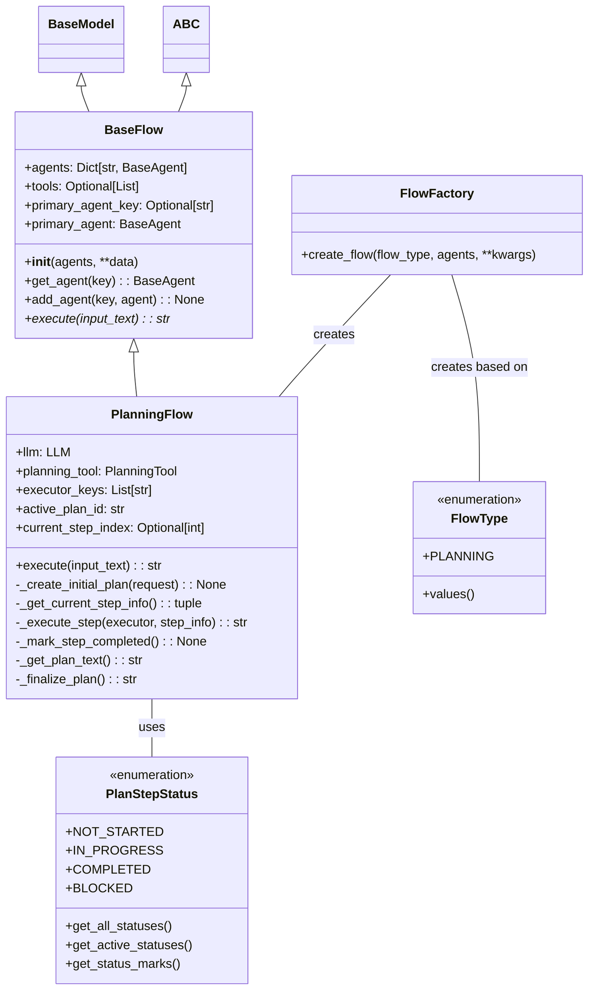

# 模块分析：流程系统（Flow System）

## 概述

流程系统是 OpenManus 的高级抽象层，负责管理多个代理的协作，实现任务的自动规划和执行。流程系统抽象了任务执行的过程，让代理能够按照一定的模式协同工作，从而解决复杂任务。核心流程实现是 `PlanningFlow`，支持基于计划的任务分解和执行。

## 核心组件解析

### 1. 流程基类 (`BaseFlow`)

位于 `app/flow/base.py` 的 `BaseFlow` 类定义了所有流程的基本接口和共享功能：

```python
class BaseFlow(BaseModel, ABC):
    """Base class for execution flows supporting multiple agents"""

    agents: Dict[str, BaseAgent]
    tools: Optional[List] = None
    primary_agent_key: Optional[str] = None

    class Config:
        arbitrary_types_allowed = True

    # 初始化流程，支持多种方式提供代理，并设置主要代理
    def __init__(
        self, agents: Union[BaseAgent, List[BaseAgent], Dict[str, BaseAgent]], **data
    ):
        # Handle different ways of providing agents
        if isinstance(agents, BaseAgent):
            agents_dict = {"default": agents}
        elif isinstance(agents, list):
            agents_dict = {f"agent_{i}": agent for i, agent in enumerate(agents)}
        else:
            agents_dict = agents

        # If primary agent not specified, use first agent
        primary_key = data.get("primary_agent_key")
        if not primary_key and agents_dict:
            primary_key = next(iter(agents_dict))
            data["primary_agent_key"] = primary_key

        # Set the agents dictionary
        data["agents"] = agents_dict

        # Initialize using BaseModel's init
        super().__init__(**data)

    # 获取流程的主要代理
    @property
    def primary_agent(self) -> Optional[BaseAgent]:
        """Get the primary agent for the flow"""
        return self.agents.get(self.primary_agent_key)

    # 通过键获取特定代理
    def get_agent(self, key: str) -> Optional[BaseAgent]:
        """Get a specific agent by key"""
        return self.agents.get(key)

    # 向流程添加新代理
    def add_agent(self, key: str, agent: BaseAgent) -> None:
        """Add a new agent to the flow"""
        self.agents[key] = agent

    # 执行流程，子类必须实现此方法
    @abstractmethod
    async def execute(self, input_text: str) -> str:
        """Execute the flow with given input"""
```

### 2. 流程工厂 (`FlowFactory`)

`FlowFactory` 简化了流程实例的创建过程，支持根据类型创建不同流程：

```python
class FlowType(str, Enum):
    """Enum for flow types."""

    PLANNING = "planning"
    # 可扩展其他流程类型


class FlowFactory:
    """Factory for creating flow instances."""

    @staticmethod
    def create_flow(
        flow_type: FlowType,
        agents: Union[BaseAgent, List[BaseAgent], Dict[str, BaseAgent]],
        **kwargs,
    ) -> BaseFlow:
        """Create a flow of the specified type.

        Args:
            flow_type: The type of flow to create.
            agents: The agent(s) to use in the flow.
            **kwargs: Additional arguments for flow initialization.

        Returns:
            An instance of the requested flow type.

        Raises:
            ValueError: If the flow type is not supported.
        """
        if flow_type == FlowType.PLANNING:
            from app.flow.planning import PlanningFlow

            return PlanningFlow(agents=agents, **kwargs)
        else:
            raise ValueError(f"Unsupported flow type: {flow_type}")
```

### 3. 计划步骤状态 (`PlanStepStatus`)

`PlanStepStatus` 是枚举类，定义了计划步骤的可能状态：

```python
class PlanStepStatus(str, Enum):
    """Enum class defining possible statuses of a plan step"""

    NOT_STARTED = "not_started"
    IN_PROGRESS = "in_progress"
    COMPLETED = "completed"
    BLOCKED = "blocked"

    @classmethod
    def get_all_statuses(cls) -> list[str]:
        """Return a list of all possible step status values"""
        return [status.value for status in cls]

    @classmethod
    def get_active_statuses(cls) -> list[str]:
        """Return a list of values representing active statuses (not started or in progress)"""
        return [cls.NOT_STARTED.value, cls.IN_PROGRESS.value]

    @classmethod
    def get_status_marks(cls) -> Dict[str, str]:
        """Return a mapping of statuses to their marker symbols"""
        return {
            cls.COMPLETED.value: "[✓]",
            cls.IN_PROGRESS.value: "[→]",
            cls.BLOCKED.value: "[!]",
            cls.NOT_STARTED.value: "[ ]",
        }
```

### 4. 规划流程 (`PlanningFlow`)

`PlanningFlow` 是主要的流程实现，支持基于计划的任务分解和执行：

```python
class PlanningFlow(BaseFlow):
    """A flow that manages planning and execution of tasks using agents."""

    llm: LLM = Field(default_factory=lambda: LLM())
    planning_tool: PlanningTool = Field(default_factory=PlanningTool)
    executor_keys: List[str] = Field(default_factory=list)
    active_plan_id: str = Field(default_factory=lambda: f"plan_{int(time.time())}")
    current_step_index: Optional[int] = None

    # 初始化规划流程，设置执行代理和规划工具
    def __init__(
        self, agents: Union[BaseAgent, List[BaseAgent], Dict[str, BaseAgent]], **data
    ):
        # Set executor keys before super().__init__
        if "executors" in data:
            data["executor_keys"] = data.pop("executors")

        # Set plan ID if provided
        if "plan_id" in data:
            data["active_plan_id"] = data.pop("plan_id")

        # Initialize the planning tool if not provided
        if "planning_tool" not in data:
            planning_tool = PlanningTool()
            data["planning_tool"] = planning_tool

        # Call parent's init with the processed data
        super().__init__(agents, **data)

        # Set executor_keys to all agent keys if not specified
        if not self.executor_keys:
            self.executor_keys = list(self.agents.keys())
```

#### 核心方法

1. **`execute`**: 执行规划流程的主方法，包括计划创建和步骤执行：

```python
async def execute(self, input_text: str) -> str:
    """Execute the planning flow with agents."""
    try:
        if not self.primary_agent:
            raise ValueError("No primary agent available")

        # Create initial plan if input provided
        if input_text:
            await self._create_initial_plan(input_text)

            # Verify plan was created successfully
            if self.active_plan_id not in self.planning_tool.plans:
                logger.error(
                    f"Plan creation failed. Plan ID {self.active_plan_id} not found in planning tool."
                )
                return f"Failed to create plan for: {input_text}"

        result = ""
        while True:
            # Get current step to execute
            self.current_step_index, step_info = await self._get_current_step_info()

            # Exit if no more steps or plan completed
            if self.current_step_index is None:
                result += await self._finalize_plan()
                break

            # Execute current step with appropriate agent
            step_type = step_info.get("type") if step_info else None
            executor = self.get_executor(step_type)
            step_result = await self._execute_step(executor, step_info)
            result += step_result + "\n"

            # Check if agent wants to terminate
            if hasattr(executor, "state") and executor.state == AgentState.FINISHED:
                break

        return result
    except Exception as e:
        logger.error(f"Error in PlanningFlow: {str(e)}")
        return f"Execution failed: {str(e)}"
```

2. **`_create_initial_plan`**: 根据用户输入创建初始规划计划：

```python
async def _create_initial_plan(self, request: str) -> None:
    """Create an initial plan based on the request using the flow's LLM and PlanningTool."""
    logger.info(f"Creating initial plan with ID: {self.active_plan_id}")

    # Create a system message for plan creation
    system_message = Message.system_message(
        "You are a planning assistant. Create a concise, actionable plan with clear steps. "
        "Focus on key milestones rather than detailed sub-steps. "
        "Optimize for clarity and efficiency."
    )

    # Create a user message with the request
    user_message = Message.user_message(
        f"Create a reasonable plan with clear steps to accomplish the task: {request}"
    )

    # Call LLM with PlanningTool
    response = await self.llm.ask_tool(
        messages=[user_message],
        system_msgs=[system_message],
        tools=[self.planning_tool.to_param()],
        tool_choice=ToolChoice.AUTO,
    )

    # Process tool calls if present
    if response.tool_calls:
        for tool_call in response.tool_calls:
            if tool_call.function.name == "planning":
                # Parse the arguments
                args = tool_call.function.arguments
                if isinstance(args, str):
                    try:
                        args = json.loads(args)
                    except json.JSONDecodeError:
                        logger.error(f"Failed to parse tool arguments: {args}")
                        continue

                # Ensure plan_id is set correctly and execute the tool
                args["plan_id"] = self.active_plan_id

                # Execute the tool via ToolCollection instead of directly
                result = await self.planning_tool.execute(**args)

                logger.info(f"Plan creation result: {str(result)}")
                return

    # If execution reached here, create a default plan
    logger.warning("Creating default plan")

    # Create default plan using the ToolCollection
    await self.planning_tool.execute(
        **{
            "command": "create",
            "plan_id": self.active_plan_id,
            "title": f"Plan for: {request[:50]}{'...' if len(request) > 50 else ''}",
            "steps": ["Analyze request", "Execute task", "Verify results"],
        }
    )
```

3. **`_get_current_step_info`**: 获取当前要执行的步骤信息：

```python
async def _get_current_step_info(self) -> tuple[Optional[int], Optional[dict]]:
    """Get the information for the current executable step."""
    plan = self.planning_tool.plans.get(self.active_plan_id)
    if not plan or "steps" not in plan:
        return None, None

    steps = plan.get("steps", [])

    # Find first step with active status
    for i, step in enumerate(steps):
        status = step.get("status", PlanStepStatus.NOT_STARTED.value)
        if status in PlanStepStatus.get_active_statuses():
            # Mark this step as in progress
            steps[i]["status"] = PlanStepStatus.IN_PROGRESS.value
            return i, step

    # No active steps found
    return None, None
```

4. **`_execute_step`**: 使用相应的代理执行当前步骤：

```python
async def _execute_step(self, executor: BaseAgent, step_info: dict) -> str:
    """Execute a single step using the selected agent."""
    if not step_info:
        return "No step information provided"

    # Extract step details
    step_id = step_info.get("id", "unknown")
    description = step_info.get("description", "No description")

    # Format the step as a user request for the agent
    formatted_request = f"Execute the following task: {description}\n"
    formatted_request += f"This is step {step_id} in the plan.\n"

    # Add context about the plan if available
    formatted_request += f"Current plan context:\n{await self._get_plan_text()}"

    # Execute the step with the selected agent
    logger.info(f"Executing step {step_id}: {description}")
    result = await executor.run(formatted_request)

    # Mark step as completed
    await self._mark_step_completed()

    return f"Step {step_id} completed: {result}"
```

5. **`_finalize_plan`**: 总结计划执行结果：

```python
async def _finalize_plan(self) -> str:
    """Summarize the execution of the plan."""
    plan = self.planning_tool.plans.get(self.active_plan_id)
    if not plan:
        return "No active plan found to finalize"

    plan_title = plan.get("title", "Untitled Plan")
    steps = plan.get("steps", [])

    # Count step status distribution
    completed = sum(1 for step in steps if step.get("status") == PlanStepStatus.COMPLETED.value)
    blocked = sum(1 for step in steps if step.get("status") == PlanStepStatus.BLOCKED.value)
    total = len(steps)

    # Generate summary
    summary = f"Plan '{plan_title}' execution summary:\n"
    summary += f"- Total steps: {total}\n"
    summary += f"- Completed steps: {completed}\n"
    summary += f"- Blocked steps: {blocked}\n"

    if completed == total:
        summary += "All steps completed successfully!"
    else:
        summary += f"Plan execution incomplete. {total - completed - blocked} steps not started, {blocked} steps blocked."

    return summary
```

## 流程系统类图



## 流程执行流程图

```mermaid
sequenceDiagram
    participant User
    participant RunFlow as run_flow.py
    participant Factory as FlowFactory
    participant Flow as PlanningFlow
    participant LLM
    participant Tool as PlanningTool
    participant Agent as Executor Agent

    User->>RunFlow: 输入请求
    RunFlow->>Factory: create_flow(FlowType.PLANNING, agents)
    Factory-->>RunFlow: PlanningFlow实例
    RunFlow->>Flow: execute(request)

    Flow->>Flow: _create_initial_plan(request)
    Flow->>LLM: ask_tool(planning_tool)
    LLM-->>Flow: plan结构
    Flow->>Tool: execute(create, plan_id, ...)
    Tool-->>Flow: plan创建结果

    loop 执行步骤
        Flow->>Flow: _get_current_step_info()

        alt 有可执行步骤
            Flow->>Flow: get_executor(step_type)
            Flow->>Agent: run(formatted_request)
            Agent-->>Flow: 执行结果
            Flow->>Flow: _mark_step_completed()
        else 无步骤或已完成
            Flow->>Flow: _finalize_plan()
            break 结束循环
        end
    end

    Flow-->>RunFlow: 执行结果
    RunFlow-->>User: 显示结果
```

## 关键特点与分析

### 设计特点

1. **抽象层次化**：通过基类和工厂模式实现流程抽象，支持多种流程类型
2. **多代理协作**：流程系统支持管理多个代理，并根据任务类型选择合适的执行者
3. **任务规划分解**：实现了任务的自动规划和分步执行，提高复杂任务处理能力
4. **状态追踪**：使用状态枚举和标记系统追踪每个步骤的执行情况
5. **错误处理**：全局异常捕获和日志记录，提高系统稳定性

### 实现细节分析

1. **代理管理**
   - 支持多种方式初始化代理（单个、列表、字典）
   - 自动选择主要代理和执行代理
   - 根据步骤类型智能分配执行代理

2. **计划创建流程**
   - 使用 LLM 生成结构化计划
   - 包含默认计划创建作为备选
   - 通过工具接口统一管理计划数据

3. **步骤执行模式**
   - 状态驱动的执行模式，按照步骤状态选择下一步执行
   - 自动更新步骤状态，支持任务进度可视化
   - 执行结果聚合和格式化处理

### 优缺点分析

**优点**
1. **模块化设计**：通过抽象类和工厂模式实现高度模块化，易于扩展
2. **任务分解能力**：自动将复杂任务分解为可管理的步骤，提高处理复杂问题的能力
3. **代理复用**：支持多种代理协作，充分利用不同代理的专长
4. **状态管理**：详细的状态追踪，便于监控执行进度和调试

**缺点**
1. **固定执行模式**：当前主要支持线性执行模式，缺乏条件分支和并行执行
2. **计划调整能力有限**：执行过程中对计划的动态调整能力有限
3. **单一流程类型**：目前只实现了规划类型流程，其他流程模式待扩展

## 待改进方向

1. **条件分支支持**：增加对条件分支和决策点的支持，使计划能够基于中间结果自适应调整
2. **并行执行能力**：支持多个不相互依赖的步骤并行执行，提高效率
3. **动态计划修改**：增强执行过程中动态调整计划的能力
4. **更多流程类型**：实现更多流程类型，如对话流程、探索流程等
5. **计划可视化**：提供更直观的计划执行可视化界面，便于监控和调试
