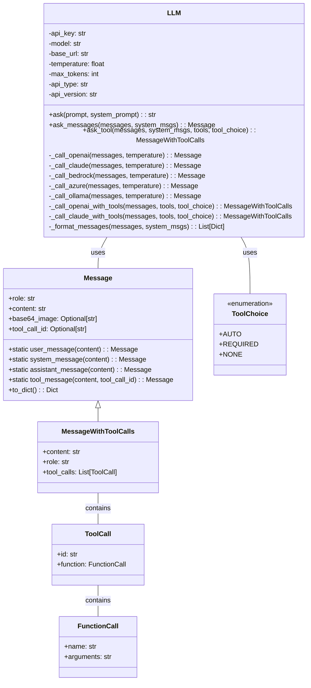
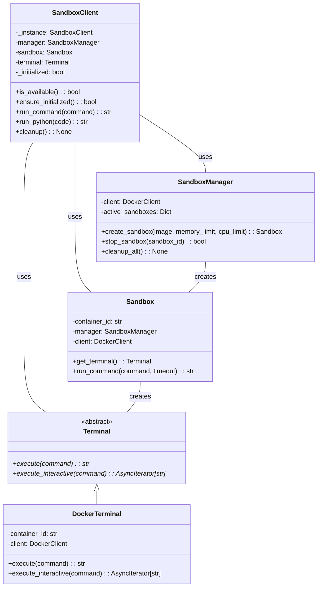
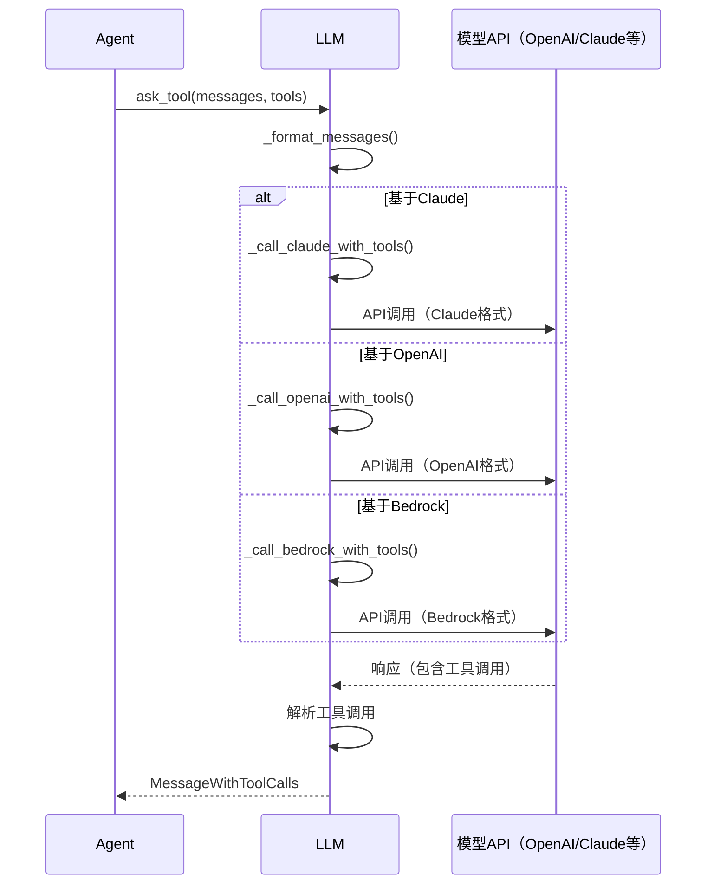
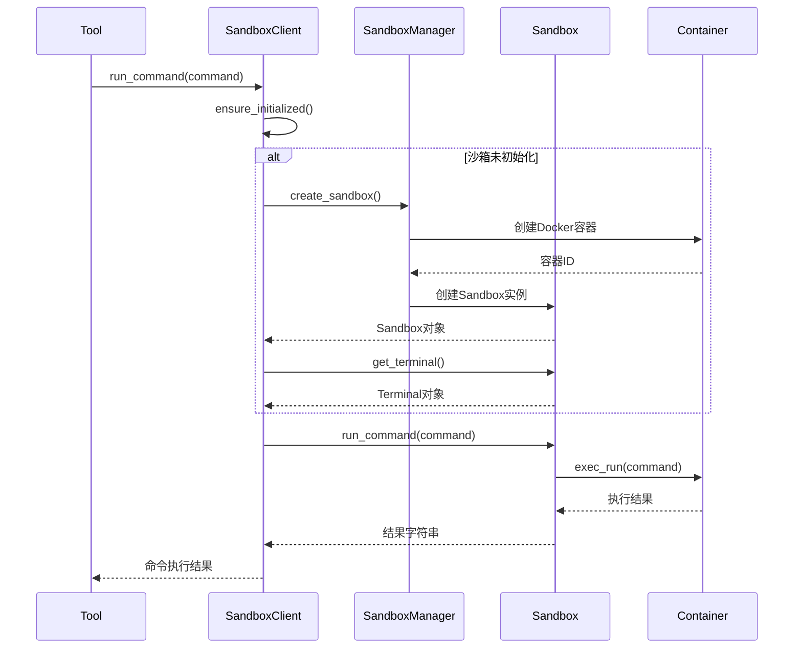

# 模块分析：LLM和沙箱系统

## 1. LLM模块概述

LLM（大语言模型）模块是 OpenManus 的核心交互层，负责管理与各种大语言模型服务的通信，统一不同模型的接口，处理提示词格式化和模型响应解析。该模块支持多种模型提供商，包括OpenAI、Anthropic Claude、Azure OpenAI、Amazon Bedrock等。

LLM模块具有高度的灵活性，可以根据配置动态选择模型提供商和具体模型，同时处理不同服务之间的接口差异。

## 2. LLM系统实现分析

### 2.1 核心LLM类

`LLM` 类是大语言模型交互的主要接口，定义在 `app/llm.py` 中：

```python
class LLM:
    """Class for interacting with various large language models."""

    def __init__(
        self,
        api_key: Optional[str] = None,
        model: Optional[str] = None,
        base_url: Optional[str] = None,
        temperature: Optional[float] = None,
        max_tokens: Optional[int] = None,
        config_name: Optional[str] = None,
        api_type: Optional[str] = None,
        api_version: Optional[str] = None,
    ):
        # 从配置或参数中加载设置
        if config_name:
            config_data = config.get_llm_config(config_name)
        else:
            config_data = config.llm

        # 优先使用参数值，否则使用配置值
        self.api_key = api_key or config_data.get("api_key")
        self.model = model or config_data.get("model")
        self.base_url = base_url or config_data.get("base_url")
        self.temperature = temperature or config_data.get("temperature", 0.0)
        self.max_tokens = max_tokens or config_data.get("max_tokens", 4096)
        self.api_type = api_type or config_data.get("api_type")
        self.api_version = api_version or config_data.get("api_version")

        # 验证必要的配置
        if not self.api_key or not self.model:
            raise ValueError("API key and model must be provided")
```

### 2.2 主要方法

`LLM` 类提供了几种与模型交互的方法，适应不同的使用场景：

1. **基本问答**：`ask` 方法用于简单的文本生成

```python
async def ask(
    self,
    prompt: str,
    system_prompt: Optional[str] = None,
    temperature: Optional[float] = None,
) -> str:
    """Send a simple prompt to the LLM and get a text response."""
    messages = [Message.user_message(prompt)]
    if system_prompt:
        system_msgs = [Message.system_message(system_prompt)]
    else:
        system_msgs = []

    response = await self.ask_messages(
        messages=messages,
        system_msgs=system_msgs,
        temperature=temperature,
    )

    return response.content or ""
```

2. **消息对话**：`ask_messages` 方法支持完整的消息历史和系统提示

```python
async def ask_messages(
    self,
    messages: List[Message],
    system_msgs: Optional[List[Message]] = None,
    temperature: Optional[float] = None,
) -> Message:
    """Send a list of messages to the LLM and get a response."""
    # 处理消息格式化
    formatted_messages = self._format_messages(messages, system_msgs)

    # 检测模型类型并使用相应的客户端
    if self.api_type == "aws":
        # Amazon Bedrock处理
        response = await self._call_bedrock(formatted_messages, temperature)
    elif self.api_type == "azure":
        # Azure OpenAI处理
        response = await self._call_azure(formatted_messages, temperature)
    elif self.api_type == "ollama":
        # Ollama处理
        response = await self._call_ollama(formatted_messages, temperature)
    elif "claude" in self.model.lower():
        # Anthropic Claude处理
        response = await self._call_claude(formatted_messages, temperature)
    else:
        # OpenAI处理（默认）
        response = await self._call_openai(formatted_messages, temperature)

    return response
```

3. **工具调用**：`ask_tool` 方法支持工具定义和调用

```python
async def ask_tool(
    self,
    messages: List[Message],
    system_msgs: Optional[List[Message]] = None,
    tools: Optional[List[Dict]] = None,
    tool_choice: Optional[ToolChoice] = None,
    temperature: Optional[float] = None,
) -> MessageWithToolCalls:
    """Send messages to the LLM with tool definitions and get a response with tool calls."""
    # 格式化消息
    formatted_messages = self._format_messages(messages, system_msgs)

    # 根据模型类型选择合适的API调用
    # 每种模型处理工具调用的方式有所不同
    if "claude" in self.model.lower():
        # Claude工具调用处理
        response = await self._call_claude_with_tools(
            formatted_messages, tools, tool_choice, temperature
        )
    else:
        # OpenAI工具调用处理（默认）
        response = await self._call_openai_with_tools(
            formatted_messages, tools, tool_choice, temperature
        )

    return response
```

### 2.3 模型特定实现

`LLM` 类为不同的模型提供商实现了专用的调用方法：

1. **OpenAI调用**：

```python
async def _call_openai(
    self, messages: List[Dict], temperature: Optional[float] = None
) -> Message:
    """Call OpenAI API with the given messages."""
    from openai import AsyncOpenAI

    client = AsyncOpenAI(api_key=self.api_key, base_url=self.base_url)

    try:
        response = await client.chat.completions.create(
            model=self.model,
            messages=messages,
            temperature=temperature or self.temperature,
            max_tokens=self.max_tokens,
        )

        # 解析并返回响应消息
        message = response.choices[0].message
        return Message.assistant_message(message.content or "")
    except Exception as e:
        logger.error(f"OpenAI API call failed: {str(e)}")
        raise
```

2. **Claude调用**：

```python
async def _call_claude(
    self, messages: List[Dict], temperature: Optional[float] = None
) -> Message:
    """Call Anthropic Claude API with the given messages."""
    from anthropic import AsyncAnthropic

    client = AsyncAnthropic(api_key=self.api_key, base_url=self.base_url)

    # 将消息转换为Claude格式
    claude_messages = self._convert_to_claude_messages(messages)

    try:
        response = await client.messages.create(
            model=self.model,
            messages=claude_messages,
            temperature=temperature or self.temperature,
            max_tokens=self.max_tokens,
        )

        content = response.content[0].text
        return Message.assistant_message(content)
    except Exception as e:
        logger.error(f"Claude API call failed: {str(e)}")
        raise
```

### 2.4 工具调用处理

对于工具调用功能，`LLM` 类实现了特定的方法来处理不同模型的工具调用格式：

```python
async def _call_openai_with_tools(
    self,
    messages: List[Dict],
    tools: Optional[List[Dict]] = None,
    tool_choice: Optional[ToolChoice] = None,
    temperature: Optional[float] = None,
) -> MessageWithToolCalls:
    """Call OpenAI API with tools."""
    from openai import AsyncOpenAI

    client = AsyncOpenAI(api_key=self.api_key, base_url=self.base_url)

    # 准备工具选择参数
    tool_choice_param = None
    if tool_choice:
        if tool_choice == ToolChoice.AUTO:
            tool_choice_param = "auto"
        elif tool_choice == ToolChoice.REQUIRED:
            tool_choice_param = "required"

    try:
        response = await client.chat.completions.create(
            model=self.model,
            messages=messages,
            tools=tools,
            tool_choice=tool_choice_param,
            temperature=temperature or self.temperature,
            max_tokens=self.max_tokens,
        )

        # 解析响应和工具调用
        message = response.choices[0].message
        content = message.content or ""

        # 提取工具调用信息
        tool_calls = []
        if hasattr(message, "tool_calls") and message.tool_calls:
            for tool_call in message.tool_calls:
                tool_calls.append(
                    ToolCall(
                        id=tool_call.id,
                        function=FunctionCall(
                            name=tool_call.function.name,
                            arguments=tool_call.function.arguments,
                        ),
                    )
                )

        return MessageWithToolCalls(
            content=content, role="assistant", tool_calls=tool_calls
        )
    except Exception as e:
        logger.error(f"OpenAI API call with tools failed: {str(e)}")
        raise
```

## 3. 沙箱系统概述

沙箱系统提供了一个安全隔离的环境，用于执行代码和命令，防止恶意操作影响主系统。该系统使用 Docker 或其他容器技术创建隔离环境，支持 Python 代码执行和命令行操作。

沙箱系统的主要目标是提供一个安全且受控的执行环境，同时维持与外部系统的有限交互能力，使代理能够执行必要的操作而不会危及系统安全。

## 4. 沙箱系统实现分析

### 4.1 沙箱客户端 (`SandboxClient`)

`SandboxClient` 是与沙箱环境交互的主要接口，定义在 `app/sandbox/client.py` 中：

```python
class SandboxClient:
    """Client for interacting with sandbox environments."""

    _instance = None
    manager: Optional[SandboxManager] = None
    sandbox: Optional[Sandbox] = None
    terminal: Optional[Terminal] = None

    # 单例模式实现
    def __new__(cls, *args, **kwargs):
        if cls._instance is None:
            cls._instance = super(SandboxClient, cls).__new__(cls)
            cls._instance._initialized = False
        return cls._instance

    def __init__(self):
        # 仅初始化一次
        if self._initialized:
            return

        # 根据配置初始化沙箱
        if config.sandbox.get("use_sandbox", False):
            self.manager = SandboxManager()
        self._initialized = True

    def is_available(self) -> bool:
        """Check if the sandbox is available for use."""
        return self.manager is not None

    async def ensure_initialized(self) -> bool:
        """Ensure the sandbox is initialized and ready for use."""
        if not self.is_available():
            return False

        try:
            if not self.sandbox:
                # Initialize sandbox container
                self.sandbox = await self.manager.create_sandbox(
                    image=config.sandbox.get("image", "python:3.12-slim"),
                    memory_limit=config.sandbox.get("memory_limit", "512m"),
                    cpu_limit=config.sandbox.get("cpu_limit", 1.0),
                    network_enabled=config.sandbox.get("network_enabled", False),
                    workdir=config.sandbox.get("work_dir", "/workspace"),
                )

            if not self.terminal:
                # Initialize terminal interface
                self.terminal = await self.sandbox.get_terminal()

            return True
        except Exception as e:
            logger.error(f"Failed to initialize sandbox: {str(e)}")
            return False
```

### 4.2 沙箱管理器 (`SandboxManager`)

`SandboxManager` 负责沙箱容器的创建和管理：

```python
class SandboxManager:
    """Manages sandbox environments."""

    def __init__(self):
        # Initialize Docker client
        self.client = docker.from_env()
        self.active_sandboxes: Dict[str, Sandbox] = {}

    async def create_sandbox(
        self,
        image: str,
        memory_limit: str = "512m",
        cpu_limit: float = 1.0,
        network_enabled: bool = False,
        workdir: str = "/workspace",
    ) -> Sandbox:
        """Create a new sandbox container."""
        try:
            network_mode = "bridge" if network_enabled else "none"

            # Create and start the container
            container = self.client.containers.run(
                image=image,
                command="sleep infinity",  # Keep container running
                detach=True,
                working_dir=workdir,
                mem_limit=memory_limit,
                nano_cpus=int(cpu_limit * 1e9),  # Convert to nano CPUs
                network_mode=network_mode,
                remove=True,  # Remove container when stopped
                volumes={
                    # Optional volume mounting if needed
                },
            )

            # Create Sandbox instance
            sandbox = Sandbox(container_id=container.id, manager=self)
            self.active_sandboxes[container.id] = sandbox

            return sandbox
        except Exception as e:
            raise SandboxCreationError(f"Failed to create sandbox: {str(e)}")

    async def stop_sandbox(self, sandbox_id: str) -> bool:
        """Stop and remove a sandbox container."""
        if sandbox_id not in self.active_sandboxes:
            return False

        try:
            container = self.client.containers.get(sandbox_id)
            container.stop(timeout=5)

            del self.active_sandboxes[sandbox_id]
            return True
        except Exception as e:
            logger.error(f"Failed to stop sandbox {sandbox_id}: {str(e)}")
            return False
```

### 4.3 沙箱执行环境 (`Sandbox`)

`Sandbox` 类表示单个沙箱环境，提供代码执行和命令运行接口：

```python
class Sandbox:
    """Represents a sandbox execution environment."""

    def __init__(self, container_id: str, manager: SandboxManager):
        self.container_id = container_id
        self.manager = manager
        self.client = manager.client

    async def get_terminal(self) -> Terminal:
        """Get a terminal interface for this sandbox."""
        return DockerTerminal(self.container_id, self.client)

    async def run_command(self, command: str, timeout: int = 30) -> str:
        """Run a command in the sandbox and return the output."""
        try:
            container = self.client.containers.get(self.container_id)
            result = container.exec_run(
                cmd=["sh", "-c", command],
                workdir="/workspace",
                demux=True,
            )

            exit_code, output = result
            stdout, stderr = output

            if exit_code != 0 and stderr:
                error_msg = stderr.decode("utf-8", errors="replace")
                return f"Command failed with exit code {exit_code}: {error_msg}"

            if stdout:
                return stdout.decode("utf-8", errors="replace")
            return ""
        except Exception as e:
            raise SandboxExecutionError(f"Failed to execute command: {str(e)}")
```

### 4.4 终端接口 (`Terminal`)

`Terminal` 类提供与沙箱终端的交互界面：

```python
class Terminal(ABC):
    """Abstract base class for terminal interfaces."""

    @abstractmethod
    async def execute(self, command: str) -> str:
        """Execute a command and return the output."""

    @abstractmethod
    async def execute_interactive(self, command: str) -> AsyncIterator[str]:
        """Execute a command with streaming output."""


class DockerTerminal(Terminal):
    """Terminal implementation for Docker containers."""

    def __init__(self, container_id: str, client):
        self.container_id = container_id
        self.client = client

    async def execute(self, command: str) -> str:
        """Execute a command in the container and return the output."""
        try:
            container = self.client.containers.get(self.container_id)
            result = container.exec_run(
                cmd=["sh", "-c", command],
                workdir="/workspace",
                demux=True,
            )

            exit_code, output = result
            stdout, stderr = output

            if exit_code != 0 and stderr:
                return f"Error: {stderr.decode('utf-8', errors='replace')}"

            return stdout.decode("utf-8", errors="replace") if stdout else ""
        except Exception as e:
            return f"Execution error: {str(e)}"
```

## 5. 组件关系图

### 5.1 LLM系统类图



### 5.2 沙箱系统类图



## 6. 核心流程图

### 6.1 LLM 调用流程



### 6.2 沙箱执行流程



## 7. 关键特性分析

### 7.1 LLM 系统特性

1. **模型抽象**：提供统一接口，屏蔽底层模型差异
2. **多模型支持**：支持多种LLM服务（OpenAI、Claude、Bedrock等）
3. **工具调用**：封装不同模型的工具调用格式
4. **消息管理**：标准化消息处理和格式转换
5. **错误处理**：统一的错误捕获和日志记录
6. **配置灵活性**：支持通过配置文件和参数灵活设置

### 7.2 沙箱系统特性

1. **隔离执行**：提供隔离的代码和命令执行环境
2. **安全限制**：支持内存、CPU和网络访问限制
3. **灵活配置**：可定制沙箱环境（镜像、资源限制等）
4. **单例模式**：使用单例模式确保系统中只有一个沙箱客户端
5. **懒加载**：仅在需要时初始化沙箱环境
6. **资源清理**：自动管理容器的创建和销毁

## 8. 优缺点和改进方向

### 8.1 LLM系统

**优点**：
1. 良好的抽象和模块化设计
2. 统一的API接口，简化上层应用开发
3. 丰富的模型支持，适应不同场景

**缺点**：
1. 对每种模型的工具调用需要单独处理
2. 错误处理可能不够细致，特别是对API限流和超时

**改进方向**：
1. 增加模型响应缓存机制，减少API调用
2. 增强错误重试和故障转移能力
3. 添加模型响应的流式处理支持
4. 实现更灵活的模型选择策略（如根据任务类型选择）

### 8.2 沙箱系统

**优点**：
1. 良好的安全隔离机制
2. 灵活的配置选项
3. 简洁的抽象接口

**缺点**：
1. 依赖Docker，增加了部署复杂性
2. 命令执行缺乏细粒度的权限控制
3. 资源限制基于Docker容器，粒度有限

**改进方向**：
1. 支持更多沙箱后端（如WebAssembly）
2. 增加文件系统隔离和权限管理
3. 添加更细粒度的执行超时控制
4. 支持持久化沙箱环境，减少重复初始化开销
5. 实现沙箱环境池，提高并发处理能力
