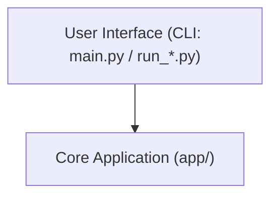
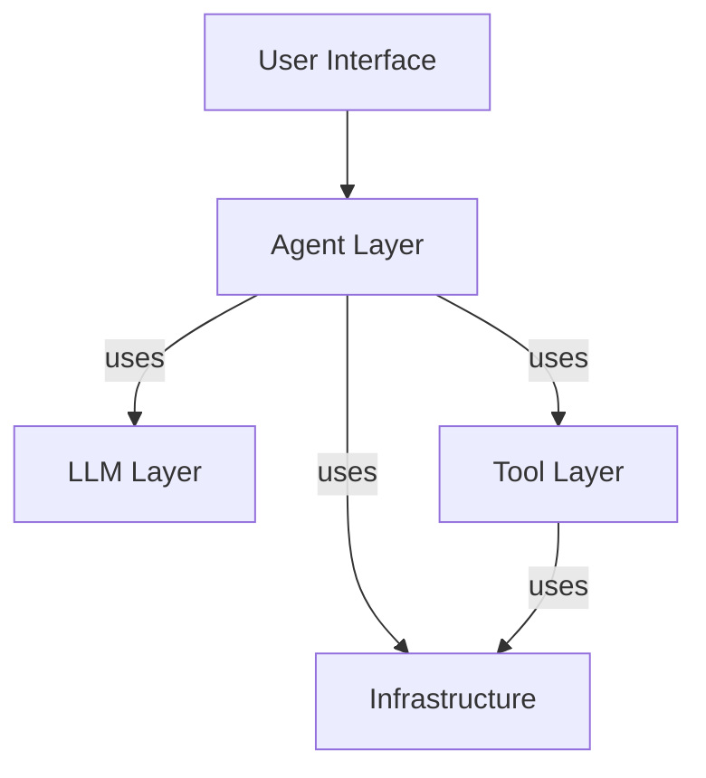
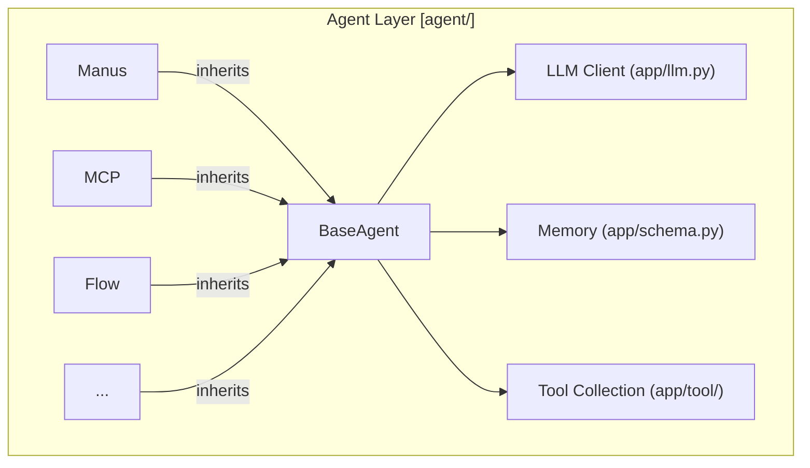
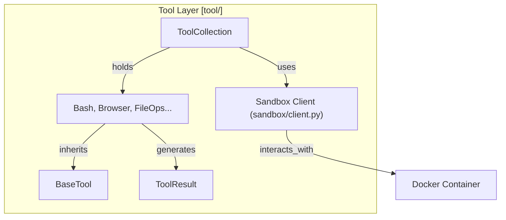
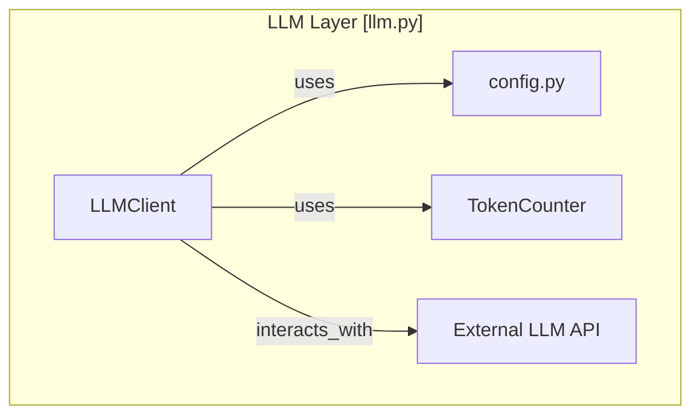
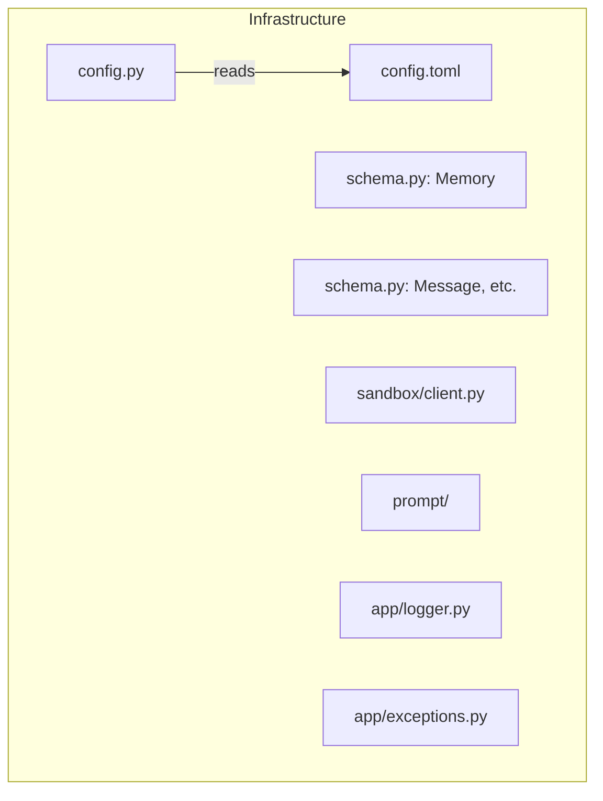

# OpenManus 架构分析

## 系统概述

OpenManus 是一个基于 Python 的开源 AI 代理框架，旨在通过 LLM（支持 OpenAI, Azure, Bedrock 等）执行用户指定的任务。它采用模块化设计，包含 Agent、Tool、LLM 交互、配置管理、内存管理、沙箱执行等核心组件。项目支持文本和多模态输入，并提供了工具调用能力。提供了多种运行入口，支持简单单次任务、多代理协作 (MCP) 和实验性的 Flow 模式。

## 核心组件

*   **配置 (`app/config.py`)**: 使用 TOML 文件和 Pydantic 模型管理全局配置（LLM、沙箱、浏览器、搜索等），采用单例模式。
*   **LLM (`app/llm.py`)**: 封装与 LLM API 的交互（文本、多模态、工具调用），包含 Token 计算、重试逻辑和错误处理。支持多种 LLM 服务商。
*   **Agent (`app/agent/`)**:
    *   `BaseAgent`: 定义 Agent 的抽象基类，包含状态机、内存、执行循环和卡顿检测。
    *   具体 Agent 实现（如 `Manus`, `MCP`, `Planning`, `SWE`, `Browser` 等）继承 `BaseAgent` 并实现 `step` 方法。
*   **Tool (`app/tool/`)**:
    *   `BaseTool`: 定义 Tool 的抽象基类和 API 参数转换。
    *   `ToolResult`: 封装工具执行结果。
    *   具体 Tool 实现（如 `Bash`, `BrowserUseTool`, `FileOperators`, `WebSearch`, `PythonExecute` 等）继承 `BaseTool` 并实现 `execute` 方法。
*   **内存 (`app/schema.py` - Memory)**: 存储 Agent 的对话历史和状态。
*   **模式 (`app/schema.py`)**: 定义了项目中使用的核心数据结构，如 `Message`, `AgentState`, `Memory`, `ToolChoice` 等，基于 Pydantic。
*   **沙箱 (`app/sandbox/`)**: 提供一个可选的隔离环境（基于 Docker）来执行代码或命令，包含客户端 (`client.py`) 和核心管理逻辑 (`core/manager.py`, `core/sandbox.py`)。
*   **提示 (`app/prompt/`)**: 存放不同 Agent 或场景使用的提示模板。
*   **流程 (`app/flow/`)**: 包含多代理协作或特定流程的实现（如 `Planning`）。
*   **入口脚本 (`main.py`, `run_mcp.py`, `run_flow.py`)**: 提供不同的方式来启动和运行 Agent。

## 主要流程 (以 `main.py` 为例)

1.  初始化 `Manus` Agent。
2.  获取用户输入 (`prompt`)。
3.  调用 `agent.run(prompt)`。
4.  `run` 方法将用户请求添加到内存，进入运行状态。
5.  循环执行 `agent.step()` 方法，直到达到最大步数或 Agent 完成。
6.  `step` 方法（在 `Manus` 或其调用的其他 Agent 中实现）会与 LLM 交互（可能调用 `llm.ask` 或 `llm.ask_tool`），根据 LLM 的响应决定下一步行动（如调用工具、更新内存、返回结果）。
7.  如果 LLM 请求工具调用，Agent 会找到相应的 Tool 实例并执行其 `execute` 方法。
8.  工具执行结果（`ToolResult`）被格式化为消息并添加到内存。
9.  Agent 继续与 LLM 交互，将工具结果提供给 LLM。
10. 循环结束后，`run` 方法返回执行摘要。

## 初步图示 (Mermaid - 简化)

### 1. 高层概览

### 2. 核心层交互

### 3. Agent 层

### 4. Tool 层与沙箱

### 5. LLM 层

### 6. 基础设施层

