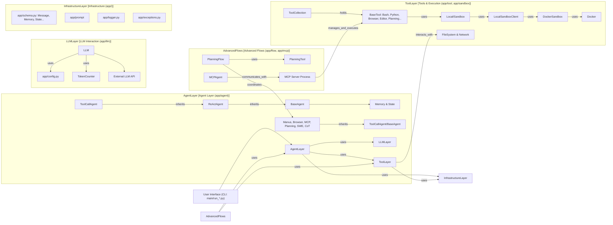

# OpenManus 代码库走读最终报告

## 概述

本报告总结了对 OpenManus 代码库进行的系统化走读分析。通过 5 个迭代周期，我们深入分析了项目的核心架构、主要 Agent 实现、工具系统、高级流程（MCP、Planning）以及基础设施。

## 导航

*   [迭代 1: 核心架构与配置](./iteration_1_analysis.md)
*   [迭代 2: 核心 Agent - Manus](./iteration_2_analysis.md)
*   [迭代 3: BrowserAgent 与核心工具](./iteration_3_analysis.md)
*   [迭代 4: 高级 Agent/Flow - MCP & Planning](./iteration_4_analysis.md)
*   [迭代 5: 其他 Agent 与整体回顾](./iteration_5_analysis.md)
*   [初始架构分析](./architecture_analysis.md)

## 系统架构总结

OpenManus 采用模块化、基于 Agent 的架构，旨在通过 LLM 驱动执行复杂任务。核心组件包括：

*   **Agent 层 (`app/agent`)**: 定义了 Agent 的基类 (`BaseAgent`, `ReActAgent`, `ToolCallAgent`) 和多种具体实现 (`Manus`, `BrowserAgent`, `MCPAgent`, `PlanningAgent`, `SWEAgent`, `CoTAgent`)。
*   **LLM 层 (`app/llm`)**: 封装与 LLM API 的交互，支持多种模型和供应商，包含 Token 计算和管理。
*   **工具层 (`app/tool`)**: 定义了工具基类 (`BaseTool`) 和集合 (`ToolCollection`)，提供了丰富的内置工具（Bash, Python, 浏览器, 文件编辑, 规划, 搜索等）。
*   **基础设施层 (`app/`)**: 提供配置管理 (`config.py`)、数据模型 (`schema.py`)、日志 (`logger.py`)、异常处理 (`exceptions.py`) 和可选的沙箱环境 (`sandbox/`)。
*   **高级流程层 (`app/flow`, `app/mcp`)**: 实现了 MCP (Agent-Server 工具执行) 和 Planning (分层/自主规划) 两种高级任务处理模式。

**核心流程**: 大多数 Agent 遵循 ReAct (Reason + Act) 模式，通过 `think` 方法与 LLM 交互获取下一步动作（文本响应或工具调用），通过 `act` 方法执行工具调用并将结果反馈给 LLM。

## 关键组件及其职责

*   **`Manus` Agent**: 默认的通用入口 Agent，继承 `BrowserAgent`，配置了广泛的工具集（Python, Browser, Editor, Terminate），并动态调整提示以优化浏览器交互。
*   **`BrowserAgent`**: 核心浏览器交互 Agent，通过注入浏览器状态（包括截图）到提示中，引导 LLM 使用 `BrowserUseTool`。
*   **`ToolCallAgent`**: 处理 LLM 工具调用的基础 Agent，负责调用 LLM 获取工具请求并在 `act` 阶段执行。
*   **`BrowserUseTool`**: 封装 `browser-use` 库，提供丰富的浏览器自动化动作，其 `extract_content` 动作会内部调用 LLM。
*   **`StrReplaceEditor`**: 提供基于字符串/行的文件编辑和撤销功能，支持本地和沙箱环境。
*   **`Bash`/`PythonExecute` Tools**: 分别提供持久化 Bash 会话和隔离进程的 Python 执行能力。
*   **`PlanningTool`**: 内存中的计划状态管理器，支持计划的创建、更新和步骤状态跟踪。
*   **`PlanningFlow`**: 分层规划协调器，使用 LLM 创建计划，并将步骤委托给执行者 Agent。
*   **`PlanningAgent`**: 自主规划执行 Agent，自身完成计划创建、步骤执行和状态更新。
*   **MCP (`MCPAgent` + `MCPServer`)**: Agent-Server 模式，将工具执行解耦到独立服务器进程。
*   **Sandbox (`DockerSandbox` + `LocalSandboxClient`)**: 提供基于 Docker 的可选隔离执行环境。

## 主要流程和数据流

1.  **用户请求**: 通过 CLI (`main.py`, `run_mcp.py`, `run_flow.py`) 发起。
2.  **Agent 初始化**: 创建相应的 Agent 实例 (e.g., `Manus`, `MCPAgent`, `PlanningFlow`)。
3.  **Agent 执行 (`run`)**: Agent 进入执行循环 (`step`)。
4.  **思考 (`think`)**: Agent (通常是 `ToolCallAgent` 或其子类) 准备上下文（可能包含历史消息、系统提示、当前状态如浏览器截图或计划状态），调用 `llm.ask_tool` 或 `llm.ask`。
5.  **LLM 响应**: LLM 返回思考内容和/或工具调用请求。
6.  **内存更新**: Agent 将 LLM 响应（作为助手消息）添加到内存。
7.  **行动 (`act`)**: 如果有工具调用请求，`ToolCallAgent.act` 负责执行：
    *   解析工具名称和参数。
    *   调用 `ToolCollection.execute`，找到并执行相应 `BaseTool` 的 `execute` 方法。
    *   工具执行（可能涉及本地操作、沙箱、浏览器库、甚至内部 LLM 调用）。
    *   工具返回 `ToolResult`。
8.  **内存更新**: Agent 将工具执行结果（作为工具消息）添加到内存。
9.  **循环**: 返回步骤 4，直到任务完成、达到最大步数或 Agent 终止。

## 设计模式和实现特点

*   **面向对象与继承**: 清晰的 Agent 和工具继承体系。
*   **协议/接口 (`Protocol`)**: 用于定义 `FileOperator` 等接口。
*   **Pydantic**: 广泛用于配置和数据模型的定义与验证。
*   **异步编程 (`asyncio`)**: 用于处理 IO 密集型操作（LLM, 工具执行, 进程交互）。
*   **单例模式**: 用于 `Config` 和 `LLM`。
*   **工厂模式**: 用于 `FlowFactory`。
*   **依赖注入**: Agent 和 Flow 接收依赖项（如 LLM, Agents, Tools）的方式。
*   **上下文管理**: `BaseAgent.state_context` 用于安全的状态转换。
*   **提示工程**: 精心设计的系统提示和动态更新的下一步提示来引导 LLM。
*   **解耦**: MCP 模式将工具执行解耦；`FileOperator` 将文件操作与环境解耦。

## 潜在问题和改进建议

*   **`PlanningTool` 持久化**: 当前计划状态存储在内存中，程序重启后会丢失。可以考虑添加文件或数据库持久化选项。
*   **`SWEAgent` 提示变量**: 检查并确认 `{{open_file}}` 提示变量的使用情况。
*   **沙箱错误处理**: 改进 `SandboxFileOperator.run_command` 对 stderr 和非零退出码的处理。
*   **`ReActAgent`/`BaseFlow` 分析**: 可以补充对这两个基类的直接分析。
*   **状态管理复杂性**: `PlanningAgent` 中手动同步工具执行和计划状态的逻辑较为复杂，可能存在边界情况。
*   **测试覆盖**: 本次走读未涉及测试代码 (`tests/`)，完整的代码理解需要分析测试用例。
*   **文档与注释**: 部分代码可以增加更详细的文档字符串或注释。

## 代码质量评估

*   **优点**: 结构清晰，模块化程度高，广泛使用类型提示和 Pydantic，异步处理得当，核心抽象设计良好，提供了多种高级 Agent 模式。
*   **缺点**: 部分实现（如 PlanningTool 持久化、部分错误处理）有待完善，某些组件（如 `ReActAgent`）的逻辑需要通过子类推断。
*   **总体**: 代码质量较高，是一个良好设计、功能丰富的 Agent 框架。

## 项目结构图 (Mermaid - 整体架构概念)

## 工作流执行摘要

*   **扫描的项目路径**: `D:\workcode\OpenManus-docs`
*   **生成的结构文件**: `output/project_structure.json` (使用 PowerShell `Get-ChildItem` 生成)
*   **生成的架构分析**: `output/architecture_analysis.md`
*   **处理的文件/模块总数**: 分析了 `app/` 目录下的大部分核心模块、`config/`、根目录入口脚本以及部分 `.github/` 文件。
*   **生成的文档和图表清单**:
    *   `output/architecture_analysis.md`
    *   `output/iteration_1_analysis.md`
    *   `output/iteration_2_analysis.md`
    *   `output/iteration_3_analysis.md`
    *   `output/iteration_4_analysis.md`
    *   `output/iteration_5_analysis.md`
    *   `output/final_report.md` (本文件)
    *   所有图表均为 Mermaid 代码块嵌入在 Markdown 文件中。
*   **工作流执行的总时长（估算）**: [根据实际情况填写，例如：约 1-2 小时]
*   **未完全覆盖的区域**: `tests/` 目录下的测试代码，`ReActAgent` 和 `BaseFlow` 基类的具体实现，部分工具（如 `WebSearch`, `CreateChatCompletion`）的详细逻辑，`MCPClients` 的实现细节，以及所有依赖库的内部工作方式。
