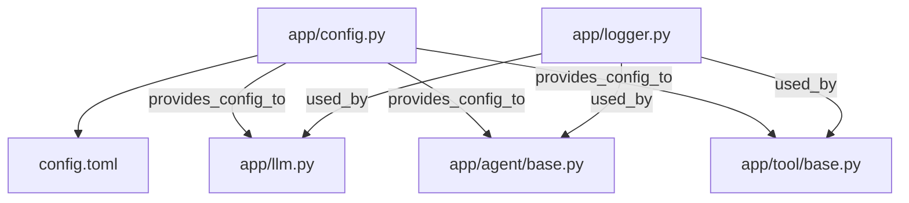
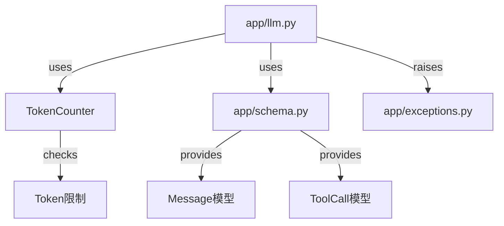
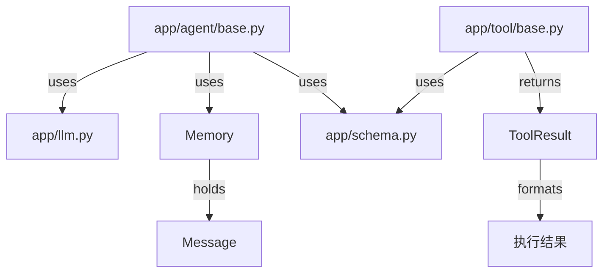

# OpenManus 代码库走读 - 迭代 1: 核心架构与配置

## 概述

本迭代周期分析了 OpenManus 项目的基础设施代码，包括配置管理、核心数据模型、LLM 交互基类、Agent 基类、Tool 基类、自定义异常和日志记录。这些模块共同构成了整个 Agent 框架的骨架。

## 关键组件解析

1.  **配置 (`app/config.py`)**:
    *   使用 `tomllib` 读取 `config/config.toml` 文件。
    *   通过 Pydantic 模型 (`LLMSettings`, `SandboxSettings`, etc.) 对配置进行结构化和验证。
    *   采用 `Config` 单例类提供全局唯一的配置访问点 (`config`)。
    *   定义了项目和工作区路径常量 (`PROJECT_ROOT`, `WORKSPACE_ROOT`)。

2.  **数据模型 (`app/schema.py`)**:
    *   定义了核心枚举 `Role`, `ToolChoice`, `AgentState`。
    *   `Message` 类是核心，封装了对话的各种消息类型，提供了便捷的创建方法和 `to_dict` 转换。
    *   `ToolCall` 和 `Function` 用于表示 LLM 的工具调用请求。
    *   `Memory` 类用于管理 `Message` 列表，支持添加、清除和限制大小。

3.  **LLM 交互 (`app/llm.py`)**:
    *   `LLM` 单例类封装了与不同 LLM API (OpenAI, Azure, Bedrock) 的交互。
    *   `TokenCounter` 使用 `tiktoken` 精确计算文本和图像 Token。
    *   提供了 `ask` (文本), `ask_with_images` (多模态), `ask_tool` (工具调用) 三种核心异步方法。
    *   实现了基于 `tenacity` 的 API 调用重试机制。
    *   包含 Token 限制检查逻辑 (`check_token_limit`, `TokenLimitExceeded`)。

4.  **Agent 基类 (`app/agent/base.py`)**:
    *   `BaseAgent` (ABC, Pydantic BaseModel) 定义了 Agent 的核心属性 (llm, memory, state) 和行为。
    *   包含状态管理 (`state_context`)、内存操作 (`update_memory`)、执行循环 (`run`) 和卡顿检测。
    *   `step` 方法为抽象方法，由具体 Agent 实现。

5.  **Tool 基类 (`app/tool/base.py`)**:
    *   `BaseTool` (ABC, Pydantic BaseModel) 定义了工具的基本接口 (name, description, parameters)。
    *   `execute` 方法为抽象方法，由具体工具实现。
    *   `to_param` 将工具转换为 LLM API 的函数描述格式。
    *   `ToolResult` (及其子类 `CLIResult`, `ToolFailure`) 用于封装工具执行结果。

6.  **异常 (`app/exceptions.py`)**:
    *   定义了 `ToolError`, `OpenManusError`, `TokenLimitExceeded` 等自定义异常，便于错误处理。

7.  **日志 (`app/logger.py`)**:
    *   使用 `loguru` 配置了同时输出到控制台和文件的日志记录器。
    *   提供全局 `logger` 实例供其他模块调用。

## 实现特点

*   **Pydantic**: 广泛使用 Pydantic 进行数据建模和验证，提高了代码的健壮性和可维护性。
*   **异步编程**: 核心交互（LLM 调用、Agent step、Tool execute）都使用了 `async/await`。
*   **模块化**: 功能划分清晰，核心抽象（Agent, Tool, LLM）设计良好。
*   **单例模式**: `Config` 和 `LLM` 使用单例模式确保全局唯一实例。
*   **错误处理**: 包含了 API 重试和自定义异常处理。

## Mermaid 图表 (组件交互 - 聚焦本迭代)

### 图1: 配置与核心依赖

### 图2: LLM 客户端关系

### 图3: Agent与Tool基础结构

## 关键发现和建议

*   基础架构设计清晰，模块化程度高。
*   Pydantic 的使用使得配置和数据模型易于理解和扩展。
*   异步设计适合 IO 密集型的 LLM 和工具调用。
*   Token 计数和限制处理是 LLM 应用的关键，这里有较好的实现。
*   后续需要关注具体 Agent 和 Tool 的实现，以及它们如何利用这些基础组件。
