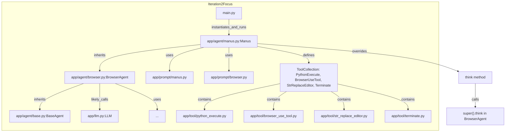

# OpenManus 代码库走读 - 迭代 2: 核心 Agent - Manus

## 概述

本迭代聚焦于通过 `main.py` 启动的默认核心 Agent——`Manus`。我们分析了它的实现 (`app/agent/manus.py`) 及其使用的提示 (`app/prompt/manus.py`)。

## 关键组件解析

1.  **入口 (`main.py`)**: 确认 `main.py` 简单地初始化 `Manus` Agent 并调用其 `run` 方法来处理用户输入。

2.  **`Manus` Agent (`app/agent/manus.py`)**:
    *   **继承关系**: `Manus` 继承自 `BrowserAgent`，这意味着其核心的 `step` 和大部分 `think` 逻辑可能在 `BrowserAgent` 中实现。
    *   **工具集**: `Manus` 配置了一个强大的工具集 (`ToolCollection`)，包括：
        *   `PythonExecute`: 执行 Python 代码。
        *   `BrowserUseTool`: 使用浏览器。
        *   `StrReplaceEditor`: 基于字符串替换的文件编辑。
        *   `Terminate`: 终止 Agent 自身执行。
    *   **提示**: 使用来自 `app/prompt/manus.py` 的特定 `SYSTEM_PROMPT` 和 `NEXT_STEP_PROMPT`，将 Agent 定位为全能助手，并指导其主动规划、分解任务、使用工具并解释结果。
    *   **动态提示调整**: `Manus` 覆盖了 `think` 方法，在调用父类的 `think` 之前，会检查最近的消息是否涉及浏览器使用。如果是，则临时切换到浏览器专用的 `NEXT_STEP_PROMPT`，以提供更具体的上下文。

3.  **提示 (`app/prompt/manus.py`)**:
    *   `SYSTEM_PROMPT` 赋予 Agent 高度自主和全能的角色定位。
    *   `NEXT_STEP_PROMPT` 强调主动规划、任务分解和结果解释。

## 实现特点

*   **继承与扩展**: `Manus` 通过继承 `BrowserAgent` 并扩展/覆盖其行为（主要是工具集和 `think` 方法中的提示调整）来实现其功能。
*   **面向任务的提示**: 提示设计旨在引导 Agent 主动解决复杂问题。
*   **动态上下文**: `think` 方法中的动态提示切换，展示了一种根据近期对话上下文调整 LLM 指令的策略。

## Mermaid 图表 (Manus Agent 及其依赖)

## 关键发现和建议

*   `Manus` Agent 的核心逻辑依赖于其父类 `BrowserAgent`。要完全理解其运作方式，**下一步必须分析 `BrowserAgent` 的实现**，特别是 `step` 和 `think` 方法。
*   `Manus` 的设计目标是成为一个多功能的通用 Agent，其配置的工具集和提示都反映了这一点。
*   动态调整提示是 Agent 实现中一个值得注意的技巧。
