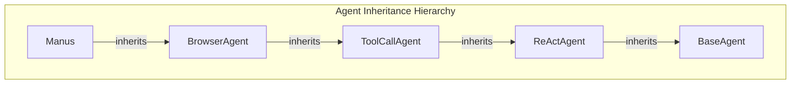
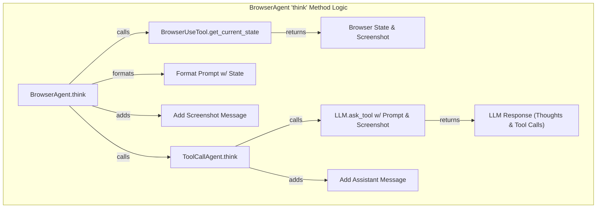
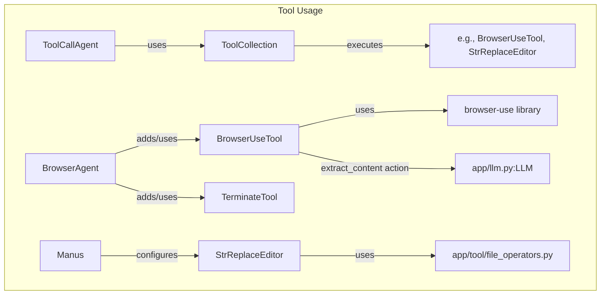
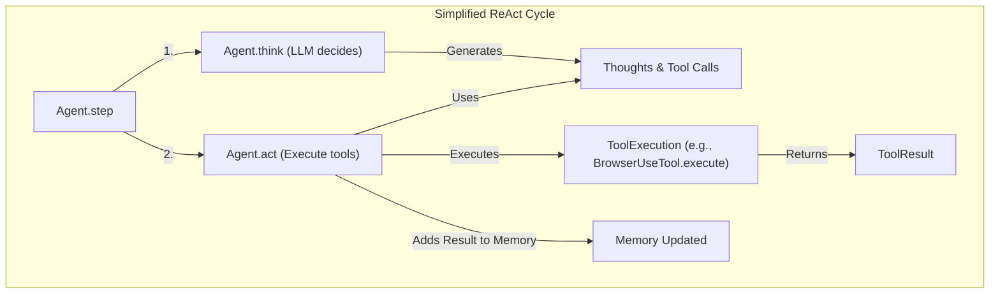

# OpenManus 代码库走读 - 迭代 3: BrowserAgent 与核心工具

## 概述

本迭代基于迭代 2 的发现，深入分析了 `Manus` Agent 的父类 `BrowserAgent` 及其更上层的父类 `ToolCallAgent`，以及它们使用的相关提示。同时，分析了 `Manus` 和 `BrowserAgent` 依赖的核心工具：`BrowserUseTool` 和 `StrReplaceEditor`。

## 关键组件解析

1.  **`ToolCallAgent` (`app/agent/toolcall.py`)**: (继承自 `ReActAgent`)
    *   **核心职责**: 实现处理 LLM 工具调用的通用逻辑。
    *   **`think` 方法**: 调用 `llm.ask_tool` 获取 LLM 的响应（包含思考内容和工具调用请求），并将响应内容和工具调用请求添加到内存。
    *   **`act` 方法**: 遍历 `think` 方法获取的工具调用列表，调用 `execute_tool` 执行每个工具，并将工具结果添加到内存。
    *   **`execute_tool` 方法**: 解析工具参数，调用 `ToolCollection` 来执行具体工具，处理特殊工具逻辑，并格式化结果。
    *   **默认工具**: `CreateChatCompletion`, `Terminate`。

2.  **`BrowserAgent` (`app/agent/browser.py`)**: (继承自 `ToolCallAgent`)
    *   **核心职责**: 为 Agent 提供浏览器交互能力和上下文。
    *   **工具**: 默认包含 `BrowserUseTool` 和 `Terminate`。
    *   **`think` 方法 (覆盖)**: 在调用父类 `think` 之前，执行以下操作：
        1.  调用 `get_browser_state` 获取当前浏览器 URL、标题、元素、滚动信息，并**截取屏幕截图**。
        2.  将截图作为 Base64 编码的**用户消息**添加到内存。
        3.  使用获取的浏览器状态**格式化 `NEXT_STEP_PROMPT`** (来自 `app/prompt/browser.py`)。
        4.  调用 `super().think()` (即 `ToolCallAgent.think`)，此时 LLM 会接收到包含浏览器上下文的提示和截图信息。
    *   **`_handle_special_tool` (覆盖)**: 在处理 `Terminate` 时，调用 `BrowserUseTool.cleanup()` 关闭浏览器。
    *   **提示 (`app/prompt/browser.py`)**: 提供非常详细和结构化的系统提示，强制 LLM 以特定 JSON 格式响应（包含状态评估、内存、下一步目标和操作序列），并提供包含浏览器状态占位符的下一步提示模板。

3.  **`BrowserUseTool` (`app/tool/browser_use_tool.py`)**: (继承自 `BaseTool`)
    *   **核心职责**: 封装 `browser-use` 库，提供浏览器自动化功能。
    *   **`execute` 方法**: 根据 `action` 参数执行各种浏览器操作（导航、点击、输入、滚动、提取、标签管理等）。
    *   **`extract_content` 动作**: 特别地，此动作会获取页面内容，然后**调用 LLM (`llm.ask_tool`)** 来根据目标提取信息。
    *   **`get_current_state` 方法**: 获取浏览器状态（URL, title, tabs, interactive_elements, scroll_info）并**截屏**，将结果打包在 `ToolResult` 中返回（状态为 JSON 字符串，截图为 base64）。
    *   **依赖**: `browser-use` 库, `app.config`, `app.llm` (用于提取)。

4.  **`StrReplaceEditor` (`app/tool/str_replace_editor.py`)**: (继承自 `BaseTool`)
    *   **核心职责**: 提供文件查看、创建、编辑（字符串替换/插入）和撤销功能。
    *   **编辑方式**: 基于精确的字符串匹配 (`str_replace`) 或行号 (`insert`)。
    *   **沙箱支持**: 通过 `FileOperator` (`LocalFileOperator` / `SandboxFileOperator`) 实现本地或沙箱环境的操作。
    *   **编辑历史**: 在内存中 (`_file_history`) 维护每个文件的编辑历史，支持 `undo_edit`。
    *   **内容截断**: 对过长的文件视图或输出进行截断。

## 实现特点与关键流程

*   **继承链**: `Manus` -> `BrowserAgent` -> `ToolCallAgent` -> `ReActAgent` -> `BaseAgent`。每一层都扩展或特化了父类的功能。
*   **ReAct 模式**: `step` 被分解为 `think` (LLM 决策) 和 `act` (工具执行)。
*   **上下文注入**: `BrowserAgent` 在 `think` 阶段巧妙地通过获取浏览器状态、截图并格式化提示，为 LLM 提供了丰富的实时上下文。
*   **结构化 LLM 输出**: `BrowserAgent` 的提示强制 LLM 输出结构化的 JSON，便于解析和执行。
*   **工具内 LLM 调用**: `BrowserUseTool` 的 `extract_content` 展示了工具在执行过程中调用 LLM 进行子任务处理的模式。
*   **沙箱与本地兼容**: `StrReplaceEditor` 通过抽象的 `FileOperator` 实现了对不同执行环境的兼容。

## Mermaid 图表 (分解)

### 1. Agent 继承关系

### 2. BrowserAgent `think` 逻辑

### 3. 工具使用关系

### 4. 简化 ReAct 流程

## 关键发现和建议

*   `ToolCallAgent` 和 `BrowserAgent` 构成了 OpenManus 中工具使用和浏览器交互的核心机制。
*   通过上下文注入和结构化提示，`BrowserAgent` 能够有效地引导 LLM 进行浏览器操作。
*   `BrowserUseTool` 是一个功能强大的封装，但其 `extract_content` 依赖 LLM 可能增加延迟和成本。
*   `StrReplaceEditor` 提供了一种相对简单但实用的文件编辑方式。
*   下一步可以分析剩余的核心工具（如 `PythonExecute`, `Bash`, `FileOperators`）以及沙箱 (`app/sandbox/`) 的实现，以完善对 `Manus` Agent 能力的理解。
