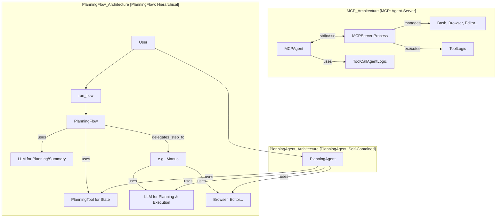

# OpenManus 代码库走读 - 迭代 4: 高级 Agent/Flow - MCP & Planning

## 概述

本迭代分析了 OpenManus 中用于处理复杂任务和多代理交互的两种机制：MCP (Model Context Protocol) 和 Planning Flow/Agent。我们分析了它们的入口脚本、核心 Agent/Flow 实现、相关提示以及支持工具。

## MCP (Model Context Protocol)

MCP 实现了一种 **Agent-Server** 架构，将工具执行与 Agent 的核心逻辑分离。

1.  **MCP 服务器 (`app.mcp.server`)**: (通过 `python -m app.mcp.server` 启动)
    *   使用 `mcp.server.fastmcp` 作为底层实现。
    *   负责加载和管理一组核心工具 (`Bash`, `BrowserUseTool`, `StrReplaceEditor`, `Terminate`)。
    *   通过 `@server.tool()` 装饰器动态注册工具方法，这些方法内部调用相应 `BaseTool` 的 `execute` 方法。
    *   监听来自 `MCPAgent` 的请求（目前通过 `stdio`），执行请求的工具，并将结果序列化（通常为 JSON）返回。

2.  **`MCPAgent` (`app/agent/mcp.py`)**: (继承自 `ToolCallAgent`)
    *   通过 `stdio` 或 `sse` 连接到 MCP 服务器。
    *   使用 `MCPClients` 类（未详细分析，但推测封装了通信协议）与服务器交互。
    *   **关键**: 将 `available_tools` 设置为 `MCPClients` 实例。
    *   `initialize`: 连接服务器，获取初始工具列表，并将工具信息添加到系统提示。
    *   `_refresh_tools`: 定期从服务器刷新工具列表，检测变化并更新内存。
    *   `think` (覆盖): 检查服务器连接状态，刷新工具，然后调用父类 `think`。LLM 会看到服务器提供的工具列表。
    *   `act`: 当父类 `ToolCallAgent.act` 调用 `available_tools.execute()` 时，请求会被转发给 `MCPClients`，后者再将请求发送给 MCP 服务器执行。
    *   `_handle_special_tool` (覆盖): 处理从服务器返回的多媒体响应（如截图），向内存添加提示信息。

3.  **入口 (`run_mcp.py`)**: 提供命令行接口，用于初始化 `MCPAgent` 并根据参数选择连接方式 (`stdio`/`sse`) 和运行模式（交互式/单提示/默认）。

4.  **提示 (`app/prompt/mcp.py`)**: 指导 Agent 作为 MCP 客户端与服务器交互，强调工具的动态性。

**MCP 总结**: MCP 机制通过独立的服务器进程执行工具，实现了 Agent 逻辑与工具执行的解耦。`MCPAgent` 充当客户端，动态发现并调用远程服务器上的工具。

## Planning Flow & Agent

OpenManus 提供了两种基于计划的任务处理机制：`PlanningFlow` 和 `PlanningAgent`。

1.  **`PlanningTool` (`app/tool/planning.py`)**: (继承自 `BaseTool`)
    *   一个**纯内存**的状态管理工具。
    *   提供 `create`, `update`, `list`, `get`, `set_active`, `mark_step`, `delete` 等命令来操作存储在 `self.plans` 字典中的计划数据（包含标题、步骤列表、步骤状态列表、步骤备注列表）。
    *   缺乏持久化能力。

2.  **`PlanningFlow` (`app/flow/planning.py`)**: (继承自 `BaseFlow`)
    *   实现了一个**分层的规划与执行**流程。
    *   **规划层**: 使用自身的 LLM 实例和 `PlanningTool` 来创建和管理计划（调用 `_create_initial_plan`）。
    *   **执行层**: 循环遍历计划步骤，为每个步骤选择一个**执行者 Agent**（从传递给 Flow 的 `agents` 字典中选择，可基于步骤类型），然后调用该执行者 Agent 的 `run` 方法，并向其传递包含**计划状态上下文**的提示（调用 `_execute_step`）。
    *   **状态更新**: 在执行者 Agent 完成步骤后，调用 `PlanningTool` 将步骤标记为完成。
    *   **总结**: 最后使用自身的 LLM 生成计划总结。
    *   **入口 (`run_flow.py` & `app/flow/flow_factory.py`)**: 通过工厂模式创建 `PlanningFlow` 实例，并将 `Manus` Agent 作为执行者传入。

3.  **`PlanningAgent` (`app/agent/planning.py`)**: (继承自 `ToolCallAgent`)
    *   实现了一个**单一 Agent 进行规划和执行**的模式。
    *   **工具**: 默认包含 `PlanningTool`。
    *   **规划与执行循环**: 在 `think` 阶段，将当前计划状态注入提示，让 LLM 决定是调用 `planning` 工具修改计划，还是调用其他工具执行当前步骤。在 `act` 阶段之后，如果执行的是非规划工具，则根据记录的关联信息调用 `planning` 工具更新对应步骤的状态。
    *   **状态跟踪**: 使用 `step_execution_tracker` 字典将工具调用 ID 与计划步骤索引关联起来，以确保在工具执行成功后更新正确的计划步骤状态。

**Planning 总结**: 提供了两种规划模式：`PlanningFlow` 采用分层协调方式，由 Flow 创建计划，由传入的 Agent 执行步骤；`PlanningAgent` 则由自身完成计划创建、步骤执行和状态更新的完整循环。

## Mermaid 图表 (MCP & Planning 概念)

## 关键发现和建议

*   MCP 提供了一种有趣的工具执行解耦方式，可能适用于需要隔离环境或资源管理的场景。
*   `PlanningFlow` 和 `PlanningAgent` 展示了两种不同的复杂任务处理模式：分层协调 vs. 单一 Agent 自主规划执行。
*   `PlanningTool` 作为核心状态管理器，其纯内存实现是目前的一个局限性。
*   `PlanningFlow` 将 `Manus` 作为执行者传入，表明 `Manus` Agent 需要具备执行各种类型任务步骤的能力。
*   `PlanningAgent` 的逻辑相对复杂，需要仔细管理计划状态与工具执行的同步。
*   下一步可以分析剩余的 Agent（如 SWE, CoT）和核心工具（Python, Bash, FileOps），以及沙箱实现。
