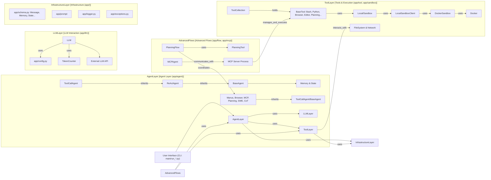

# OpenManus 代码库走读 - 迭代 5: 其他 Agent 与整体回顾

## 概述

本迭代分析了剩余的特定功能 Agent (`SWEAgent`, `CoTAgent`) 和核心工具/基础设施 (`Bash`, `PythonExecute`, `FileOperators`, Sandbox)，并对整个代码库进行了整体回顾。

## 关键组件解析

1.  **`SWEAgent` (`app/agent/swe.py`)**: (继承自 `ToolCallAgent`)
    *   定位为 AI 程序员，默认工具为 `Bash`, `StrReplaceEditor`, `Terminate`。
    *   提示 (`app/prompt/swe.py`) 强调模拟命令行交互，限制一次调用一个工具。
    *   `think` 方法使用 `Bash` 工具获取当前工作目录并注入提示。

2.  **`CoTAgent` (`app/agent/cot.py`)**: (继承自 `BaseAgent`)
    *   无工具调用能力，专注于思维链推理。
    *   `step` 方法调用 `llm.ask()` 获取文本响应。
    *   提示 (`app/prompt/cot.py`) 指导 LLM 进行 CoT 推理并按特定格式输出。

3.  **`Bash` Tool (`app/tool/bash.py`)**: (继承自 `BaseTool`)
    *   通过 `_BashSession` 管理持久化的后台 Bash 进程。
    *   实现与后台进程的异步交互、状态管理和超时处理。

4.  **`PythonExecute` Tool (`app/tool/python_execute.py`)**: (继承自 `BaseTool`)
    *   使用 `multiprocessing` 在隔离进程中安全执行 Python 代码。
    *   捕获 `print` 输出和异常，包含超时机制。

5.  **File Operators (`app/tool/file_operators.py`)**:
    *   定义 `FileOperator` 协议接口。
    *   `LocalFileOperator` 实现本地文件操作。
    *   `SandboxFileOperator` 通过 `SANDBOX_CLIENT` 实现沙箱内文件操作。

6.  **Sandbox (`app/sandbox/`)**:
    *   `DockerSandbox` (`core/sandbox.py`) 使用 `docker` 库管理容器。
    *   `LocalSandboxClient` (`client.py`) 封装 `DockerSandbox` 操作，提供全局 `SANDBOX_CLIENT`。
    *   是否启用由 `config.sandbox.use_sandbox` 控制。

## 整体回顾与发现

*   **Agent 设计模式**:
    *   清晰的继承结构 (`BaseAgent` -> `ReActAgent` -> `ToolCallAgent` -> Specific Agents)。
    *   通过覆盖方法和提示工程实现特定行为。
    *   广泛使用 Pydantic。
*   **工具系统**:
    *   `BaseTool` 和 `ToolCollection` 作为基础。
    *   工具实现多样，功能丰富。
    *   通过 `FileOperator` 实现本地/沙箱兼容。
*   **高级流程**:
    *   MCP 模式实现 Agent 与工具执行解耦。
    *   Planning 提供分层协调 (`PlanningFlow`) 和单一自主 (`PlanningAgent`) 两种模式。
*   **基础设施**:
    *   配置、数据模型、LLM 交互、日志、沙箱等模块设计良好。
*   **潜在改进点**:
    *   `PlanningTool` 缺乏持久化。
    *   `SWEAgent` 的 `{{open_file}}` 提示变量似乎未使用。
    *   `SandboxFileOperator.run_command` 对 stderr/返回码处理可改进。
    *   `ReActAgent` 和 `BaseFlow` 的具体实现未显式分析。
    *   错误处理和状态转换细节可深入探究。

## Mermaid 图表 (整体架构概念)

